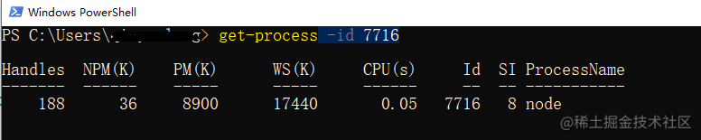

### 进程 

**进程（Process）** 是计算机中的程序关于某数据集合上的一次运行活动，是系统进行资源分配和调度的基本单位，是操作系统结构的基础，进程是线程的容器。进程之间相互独立，任一时刻，CPU总是运行一个进程，其他进程处于非运行状态。 `CPU`使用时间片轮转进度算法来实现同时运行多个进程。我们启动一个服务、运行一个实例，就是开一个服务进程，每个进程都拥有自己的独立空间地址、数据栈，一个进程无法访问另外一个进程里定义的变量、数据结构，只有建立了 `IPC`通信，进程之间才可数据共享。

使用`nodeJs`启动一个进程。

```js
    const http = require("http");
    http
      .createServer(function (req, res) {
        res.statusCode = 200;
        res.setHeader("Content-Type", "text/plain");
        res.end("你好世界\n");
      })
      .listen(3000, () => {
        process.title = "测试进程 Node.js"; // 进程进行命名
        console.log(`process.pid: `, process.pid); // process.pid: 7716
      });
```
打开任务管理器就会看到这个进程以及`pid`，`mac`系统下还可以看到包含的线程数量。




如图是`vscode`的进程管理状态，包含主进程总共14个进程


由此，我们可以简单推断`chrome浏览器是基于v8的多进程架构设计`。当然这句话不是我说猜的，是官方文档里面这样子阐述的，类似还有桌面开发框架`electron`，后续这个框架打算也单独开一个专栏分享一下开发经验。

#### 1：浏览器的进程
- 主进程：协调控制其他子进程（创建、销毁），浏览器界面显示，用户交互，前进、后退、收藏，将渲染进程得到的内存中的Bitmap，绘制到用户界面上，处理不可见操作，网络请求，文件访问等

- 插件进程：每种类型的插件对应一个进程，仅当使用该插件时才创建

- `GPU`进程：用于`3D`绘制和比如`css3`动画已经新版本的`v8`加速渲染。

- 渲染进程，就是我们说的浏览器内核，负责页面渲染，脚本执行，事件处理等，每个`tab`页一个渲染进程，`js`在浏览器端就在这里工作，前端开发重点关注和研究的区域，`js,html,css`解释器等。


### 线程

**线程是操作系统能够进行运算调度的最小单位**。线程被包含于进程之中。一个线程只能隶属于一个进程，但是一个进程是可以拥有多个线程的。进程类比工厂的车间，工厂包含多个车间，每包含多个工人。线程共享进程资源，但是独立的线程有自己的调用栈`（call stack）`，自己的寄存器环境`（register context）`。`js`单线程。

#### 1:浏览器渲染进程

上文说道`v8`多进程多线程架构，`chrome`又是以`v8`为内核，因此我们查看下浏览器渲染进程包含了那些线程：

- `GUI`渲染线程:负责渲染页面，布局和绘制,页面需要重绘和回流时，该线程就会执行,与js引擎线程互斥，防止渲染结果不可预期。

- `JS`引擎线程：负责处理解析和执行`javascript`脚本程序，只有一个JS引擎线程（单线程），与GUI渲染线程互斥，防止渲染结果不可预期。

- 事件触发线程：用来控制事件循环（鼠标点击、`setTimeout`、`ajax`等），当事件满足触发条件时，将事件放入到JS引擎所在的执行队列中。

- 定时触发器线程：`setInterval`与`setTimeout`所在的线程，定时任务并不是由JS引擎计时的，是由定时触发线程来计时的，计时完毕后，通知事件触发线程。

- 异步`http`请求线程：浏览器有一个单独的线程用于处理`AJAX`请求，当请求完成时，若有回调函数，通知事件触发线程。

#### 2: JS 是单线程
为了防止渲染出现不可预期的结果，浏览器设定 `GUI`渲染线程和`JS引擎线`程为互斥关系， 当`JS引擎`线程执行时GUI渲染线程会被挂起，GUI更新则会被保存在一个队列中等待JS引擎线程空闲时立即被执行。

#### 3： nodejs 单线程

跟上面一样，`Node.js`只是运行在服务端的脚本， 因此也是单线程模型，但是其基于`事件驱动`、`异步非阻塞模式`，可以应用于`高并发场景`，避免了线程创建、线程之间上下文切换所产生的资源开销。但是如果你有需要大量计算，CPU 耗时的操作，开发时候要注意。


### nodejs中的进程和线程
`Node.js` 是 `Javascript` 在服务端的运行环境，**构建在 chrome 的 V8 引擎之上，基于事件驱动、非阻塞I/O模型，充分利用操作系统提供的异步 I/O 进行多任务的执行，适合于 I/O 密集型的应用场景**，因为异步，程序无需阻塞等待结果返回，而是基于回调通知的机制，原本同步模式等待的时间，则可以用来处理其它任务，在 Web 服务器方面，著名的 Nginx 也是采用此模式（事件驱动），Nginx 采用 C 语言进行编写，主要用来做高性能的 Web 服务器，不适合做业务。Web业务开发中，如果你有高并发应用场景那么 Node.js 会是你不错的选择。

在多核 `CPU` 系统之上，可以用过 `child_process.fork` 开启多个进程（也可以使用`Cluster` 来实现多进程架构） ，即 多进程 + 单线程 模式。注意：**开启多进程不是为了解决高并发，主要是解决了单进程模式下 Node.js CPU 利用率不足的情况，充分利用多核 CPU 的性能。**


**总结：**

- js 是单线程，但是做为宿主环境的 Node.js 并非是单线程的。

- 由于单线程原故，一些复杂的、消耗 CPU 资源的任务建议不要交给 Node.js 来处理，当你的业务需要一些大量计算、视频编码解码等 CPU 密集型的任务，可以采用 C++。

- Node.js 和 Nginx 均采用事件驱动方式，避免了多线程的线程创建、线程上下文切换的开销。如果你的业务大多是基于 I/O 操作，那么你可以选择 Node.js 来开发。


#### 2: node 创建进程
`child_process` 模块提供了衍生子进程的能力。 总共有四种方式来创建子进程：每个方法都会返回 `ChildProcess` 实例。 这些对象实现了 `Node.js` 的 `EventEmitter` API，使得父进程可以注册监听器函数。

`child_process` 模块导出的函数  `spawnSync`, `execSync`, `execFileSync` 都有同步阻塞的版本，等待直到子进程退出。

##### 1. `child_process.spawn(command[, args][, options])`：适用于返回大量数据，例如图像处理，二进制数据处理。函数在一个新的进程里启动一个命令.

执行 `spawn` 函数 的结果是一个实现了 `EventEmitter API` 的 实例

```js
child.on('exit', function(code, signal){
    console.log('child process exited with' + `code ${code} and signal ${signal}`);
});
```
如果子进程正常退出 `singal` 变量是 `null`。

另外一些我们实例注册的事件有 `discount`，`error`，`close`，`message`:
- 当父进程手动调用 `child.discount` 的时候，`discount` 事件会被触发。
- 如果进程不能被衍生`（spawn）`或者被 `killed`，`error` 事件被触发。
- 当一个子进程的 `stdio` 关闭的时候，`close` 事件被触发。
- 当子进程使用 `process.send()` 函数发送信息的时候，`message` 事件会被触发。这就是父子进程相会交流的方式。

注意：`close` 事件和 `exit` 事件不同，因为多个子进程可能共享相同的 `stdio` 流，因此一个子进程退出不代表流关闭了。

```js
const child = spawn('find', ['.', '-type', 'f']);
```
`child.stderr`的 `data` 事件处理器将会被触发，`exit` 事件处理器会被报告一个退出码 `1`，表明有一个错误发生了。错误时退出码的值根据实际的宿主系统及错误类型。

```js
const {spawn} = require('child_process');
const child = spawn('wc');
process.stdin.pipe(child.stdin);
child.stdout.on('data', (data) => {
    console.log(`child stdout: ${data}`);
});
```
我们简单地将一个可读流 `pipe` 到另一个可写流里。对应的`shell` 代码是：
`find . -type f | wc l`。

```js
const {spawn} = require('child_process');
const find = spawn('find', ['.', '-type', 'f']);
const wc = spawn('wc', ['-l']);
find.stdout.pipe(wc.stdin);
wc.stdout.on('data', (data) => {
    console.log(`Number of files ${data}`)
});
```
在`window`上面，利用`powershell` 来处理：

```js
    const { spawn } = require("child_process");
    const child = spawn("powershell.exe", ["ls"]);
    console.log(process.env.comspec);

    child.stdout.on("data", (data) => {
      console.log(`child stdout: ${data}`);
    });

    child.stderr.on("data", function (data) {
      console.error(data);
    });

    child.on("exit", function (code, signal) {
      console.log("child process exited ", code, signal);
    });
```

配置参数：
- `env` 选项一个空对象，或者给一个对象作为子进程唯一的环境变量
- `cwd` 选项更改脚本的工作目录
```js
const child = spawn('find . -type f | wc -l', {
    stdio: 'inherit',
    shell: true,
    cwd: '/Uers/samer/Downloads'
})
```
- `detached`，它可以使子进程独立于它的父进程运行。**目前测试win10 上无法执行以下代码，不确定是因为什么。**

```js
const { spawn } = require("child_process");
const child = spawn(process.argv[0], ["timer.js"], {
  detached: true,
  stdio: "ignore", // 关闭子进程的标准输入输出配置 如果不置为 ignore，那么 父进程还是不会退出
});

child.unref();
```
##### 2. `child_process.exec()`：适用于小量数据，maxBuffer 默认值为 `200 * 1024` 超出这个默认值将会导致程序崩溃，数据量过大可采用 spawn。

默认地，`spawn` 函数并没有创建一个 `shell` 去执行我们传入地命令。这使得它比 `exec` 函数执行稍微高效一点儿，`exec` 创建了个 `shell`。

`exec` 函数有另一个主要地区别。将命令的输出放到缓冲区，并且将整个输出值传递给一个回调（而不是像 `spawn` 那样使用流）。

如果你执行外部提供的任何类型的动态输入，使用 `shell` 语法是有安全风险的。用户使用 像 ；的`shell` 语法字符和` $ `来进行命令注入攻击（例如：command + `; rm -rf ~`）。

**如果你想要使用 `shell` 语法并且运行命令输出的所期望的数据比较小，建议使用 `exec` 函数（记住，exec 在返回结果数据之前，会在内存中缓存整个数据）。**

如果期望的数据很大，那么建议使用 `spawn` 函数，因为数据可以被标准的 `IO` 对象流化（streamed）。

```js
const child = spawn('find . -type f | wc -l', {
    stdio: 'inherit',
    shell: true
});
```


##### 3. `child_process.execFile()`：类似 child_process.exec()，区别是不能通过 shell 来执行，不支持像 I/O 重定向和文件查找这样的行为.

##### 4. `child_process.fork()`： 衍生新的进程，进程之间是相互独立的，每个进程都有自己的 V8 实例、内存，系统资源是有限的，不建议衍生太多的子进程出来，通长根据系统 CPU 核心数设置。

`fork` 函数是`spawn` 函数的另一种衍生`（fork） node` 进程的形式。

 `spawn` 和 `fork` 之间最大的不同是当使用 `fork` 函数时，到子进程的通信通道被建立了，因此我们可以在子进程里通过全局的 `process` 使用 `send` 函数，在父子进程之间交换信息。通过 `EventEmitter` 模块接口实现的。下面是例子：

`parent.js`:

```js
const { fork } = require("child_process");
const forked = fork("child.js");

forked.on("message", (msg) => {
  console.log("messsgae from child", msg);
});

// 正常退出 code=0 signal=null
forked.on("exit", (code, signal) => {
  console.log("===exit", code, signal);
});

forked.on("close", (code) => {
  console.log("===close", code);
});

forked.send({ hello: "world" });
```
`child.js`:

```js
process.on("message", (msg) => {
  console.log("message from parent:", msg, process.pid, process.ppid);
});
let counter = 0;
setInterval(() => {
  if (counter === 2) {
    process.exit();
  }
  process.send({ counter: counter++ });
}, 5000);
```
通过 `ps -aux | grep node` 就会看到这两个进程

另外一个是烂大街的案例：分解`http`请少使用主线程来阻塞后面：

`main.js`:

```js
const http = require("http");
const { fork } = require("child_process");
const server = http.createServer();

server.on("request", (req, res) => {
  // 这个程序有一个很大的问题，当请求 /compute 时，服务器将不能处理其他的请求，因为事件循环在忙于长循环操作
  if (req.url === "/compute") {
    let start = Date.now();
    // const sum = longComputation();

    let ps = fork("./compute.js");
    ps.send("start");
    ps.once("message", (sum) => {
      res.end(`Sum is ${sum}--time-${Date.now() - start}`);
    });
  } else {
    res.end("Ok");
  }
});

server.listen(3000, () => {
  console.log("server is running is 3000");
});

```
`child.js`:

```js
const longComputation = () => {
  let sum = 0;
  for (let i = 0; i < 1e9; i++) {
    sum += i;
  }
  return sum;
};

process.on("message", (msg) => {
  console.log(process.pid, process.ppid);
  if (msg === "start") {
    const sum = longComputation();
    process.send(sum);
    process.exit();
  } else {
    process.send("error");
  }
});

```
这个代码，受可以 `fork` 的进程数的限制，但当我们收到需要长时间计算的请求时，可以执行它，而主线程一点儿也不会被阻塞，可以处理其他的请求。


