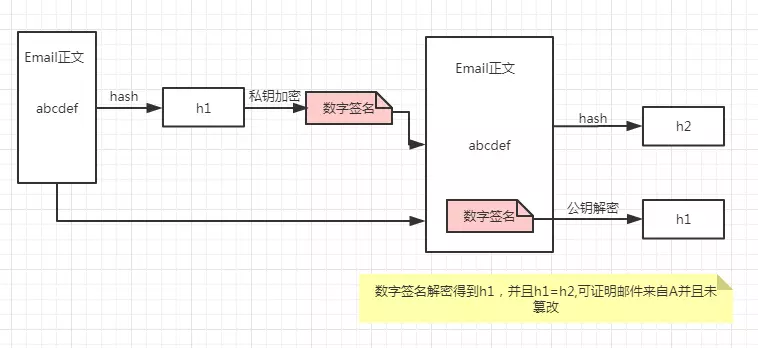

# Public-key cryptography

**公钥加密**，或者非对称加密（asymmetric cryptography），是使用的对加密系统的密钥：公共密钥可以广泛传播，并且**私钥**已知唯一的主人。这种密钥的生成依赖于基于数学问题的加密 算法来产生单向函数。有效的安全性只需要保密私钥; 公钥可以在不影响安全性的情况下公开分发。

在这样的系统中，任何人都可以使用接收者的公钥加密消息，但是加密的消息只能用接收者的私钥解密。

### 比如：
假设A要发送一封Email给B，他不想让任何其他人在传输中看到Email的内容，做法就是使用B的公钥对Email加密，只有B的私钥能够解密（B的私钥唯一性保证信件不会泄露）。但是B的公钥是公开的，方便别人跟自己联系。


>那么什么是对称加密（`Symmetric Cryptography`）呢？
**对称加密**：对称加密是最快速、最简单的一种加密方式，加密（encryption）与解密（decryption）用的是同样的密钥（secret key）。对称加密有很多种算法，由于它效率很高，所以被广泛使用在很多加密协议的核心当中。自认秘钥越大，加密越安全，但是同样加密解密的时间越长。<br/><br/>对称加密的一大**缺点**是密钥的管理与分配，换句话说，如何把密钥发送到需要解密你的消息的人的手里是一个问题。在发送密钥的过程中，密钥有很大的风险会被黑客们拦截。现实中通常的做法是将对称加密的密钥进行非对称加密，然后传送给需要它的人。


# Digital signature

**数字签名**，就是只有信息的发送者才能产生的别人无法伪造的一段数字串，这段数字串同时也是对信息的发送者发送信息真实性的一个有效证明。
数字签名是非对称密钥加密技术与数字摘要技术的应用。

> 问题
但是别人可以伪造A，使用B的公钥进行发送信息，导致B没有办法区分到底是不是A。数字签名可以解决这个问题：

- 1.A先对这封Email执行哈希运算得到hash值简称“摘要”，取名h1。
- 2.然后用自己私钥对摘要加密，生成的东西叫“数字签名”。
- 3.把数字签名加在Email正文后面，一起发送给B。（当然，为了防止邮件被窃听你可以用继续公钥加密，这个不属于数字签名范畴）。
- 4.B收到邮件后用A的公钥对数字签名解密，成功则代表Email确实来自A，失败说明有人冒充。 
- 5.B对邮件正文执行哈希运算得到hash值，取名h2
- 6.B 会对比第4步数字签名的hash值h1和自己运算得到的h2，一致则说明邮件未被篡改。





# 数字证书
　　CA是Certificate Authority的缩写，也叫“证书授权中心”。（专业的解释看“这里”）。


# https

- 1: 前提：https是在SSL/TLS协议之上。
- 2：原理，SSL/TLS协议的基本思路是采用公钥加密法，也就是说，客户端先向服务器端索要公钥，然后用公钥加密信息，服务器收到密文后，用自己的私钥解密。

> q1:如何保证公钥不被篡改？
> q2:公钥加密计算量太大，如何减少耗用的时间？

**a1**: 解决方法：将公钥放在数字证书中。只要证书是可信的，公钥就是可信的。

**a2**: 解决方法：每一次对话（session），客户端和服务器端都生成一个"对话密钥"（session key），用它来加密信息。由于"对话密钥"是对称加密，所以运算速度非常快，而服务器公钥只用于加密"对话密钥"本身，这样就减少了加密运算的消耗时间。

**核心思想就是： 解决的办法是将对称加密的密钥使用非对称加密的公钥进行加密，然后发送出去，接收方使用私钥进行解密得到对称加密的密钥，然后双方可以使用对称加密来进行沟通。**


- 3： `SSL/TLS` 协议的基本过程是：
    
    （1） 客户端向服务器端索要并验证公钥。

    （2） 双方协商生成"对话密钥"。

    （3） 双方采用"对话密钥"进行加密通信。

```
let express = require("express");
let http = require("http");
let https = require("https");
let fs = require("fs");

const httpsOption = {
    key : fs.readFileSync("./https/xxxxxxxxxxxx.key"),
    cert: fs.readFileSync("./https/xxxxxxxxxxxx.pem")
}
// Create service
let app = express();
http.createServer(app).listen(80);
https.createServer(httpsOption, app).listen(443);

```


 


