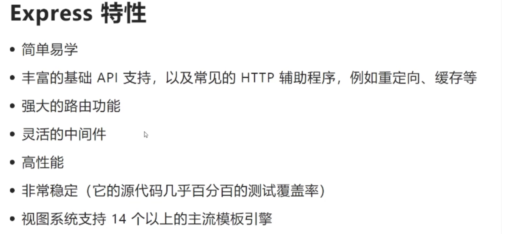
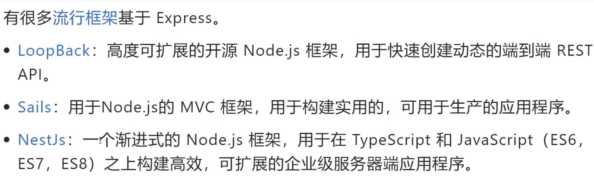
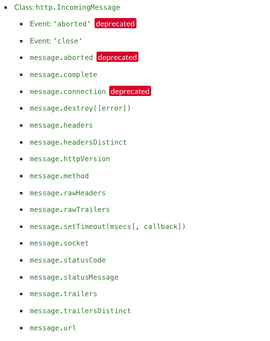
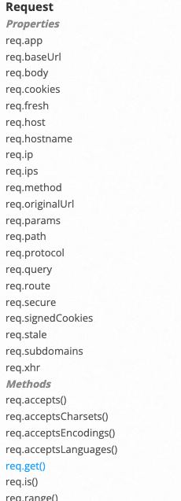
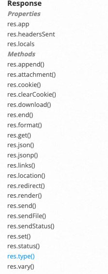
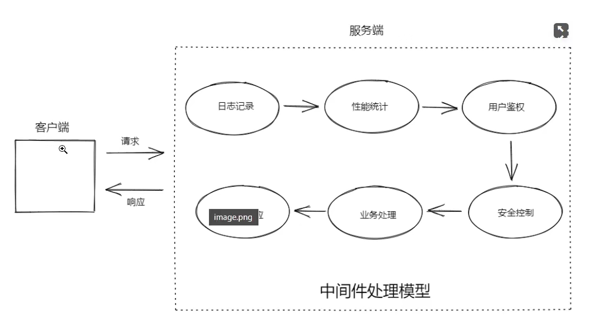
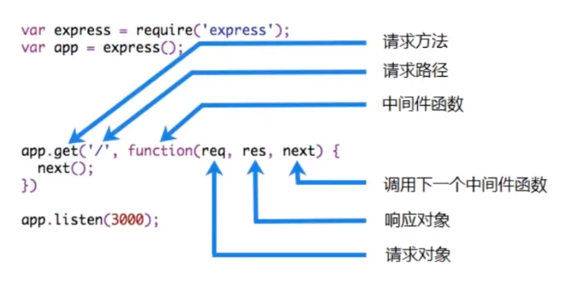

<!-- vscode-markdown-toc -->
  * 1. [1：练习案例](#1：练习案例)
  * 2. [概念](#概念)
  * 3. [Express中的中间件](#express中的中间件)
  * 4. [具体使用](#具体使用)
    * 4.1. [应用程序级别中间件](#应用程序级别中间件)
    * 4.2. [路由级别中间件](#路由级别中间件)
    * 4.3. [错误处理中间件](#错误处理中间件)
    * 4.4. [处理404【路由匹配不到情况】](#处理404【路由匹配不到情况】)
  * 5. [内置中间件](#内置中间件)

<!-- vscode-markdown-toc-config
	numbering=true
	autoSave=true
	/vscode-markdown-toc-config -->
<!-- /vscode-markdown-toc --># Express 
> Fast, unopinionated, minimalist web framework for Node.js.作者：tj, 他主要有Express、commander、ejs、co、Koa扥框架，已经离开 Node 社区，转 Go 了。


# 特性


- 丰富的 API 支持，强大而灵活的中间件特性
- 有很多流行框架基于 Express（Nestjs等）

- [Express 官网](https://expressjs.com/)
- 构成核心内容：  `express`， `router`, `request`, `response`, `application`构成。   
- 核心点是中间件的使用和了解。

# 应用场景
- 传统网站 Ghost
- 接口服务
- 服务端渲染中间层
- 发开工具`JSON Server`和`webpack-dev-server`。


# 快速了解
```
const express = require("express");
const app = express();
const port = 3000 // 默认3000

app.get("/", (req, res) => {
  res.send("Hello World");
});

app.listen(3000, () => {
  console.log(`Server running at http://localhost:${port}/`);
});

```
# 路由

```js
  app.METHOD(PATH, HANDLER)

  // eg: 
  app.put('/user', (req, res) => {
    res.send('Got a PUT request at /user')
  })
```
- `app`是 的一个实例`express`。
- `METHOD`是一个HTTP 请求方法，小写。
- PATH是服务器上的路径。
- HANDLER是路由匹配时执行的函数。

###  1. <a name='1：练习案例'></a>1：练习案例

练习实现一个CRUD的接口，实现任务清单。
- 查询任务   GET /todos
- 根据id查询单个任务  GET /todos/:id
- 添加任务  POST /todos
- 修改任务  PATCH /todos
- 删除任务  DELETE /todos/:id

整体实现相对是按照中间件的简单来处理的。

[代码实现位置 ./demo-to-do](./demo-to-do/app.js)

# 请求和响应

`Express` 不对 `Node.js` 已有的特性进行二次抽象，只是在它之上扩展了 Web 应用所需的基本功能。内部使用的还是http模块，请求对象继承自`http.IncomingMessage`。响应对象继承自`http.ServerResponse`。因此原生方法都可以继续调用。



```js
app.get('/',function(req,res){
  console.log(req.url);
  console.log(req.method);
  console.log(req.headers);

  // 比如扩展的方法 ?name=anikin
  console.log(req.query);

  // res.send 可以支持多种类型，更加方便
  res.send("hello wolrd");
})
```
因此会发现，其实`express`只是对原生的能力进行了一个扩展，具体做了哪些扩展呢？





# 中间件（核心）
```js
// 最简单的一个中间件
// next 下一个中间件
app.use((req, res, next) => {
  console.log(req.method, req.url, Date.now())
  // 交出执行权，往后继续匹配执行
  next()
})

app.get("/", (req, res) => {
  console.log(req.method, req.url, Date.now());
  res.send("get /");
});
```

###  2. <a name='概念'></a>概念
`Express`的最大特色，也是最重要的一个设计，就是中间件。在不修改原有代码的基础上，增加一些新的功能,一个Express应用，就是由许许多多的中间件来完成的。常见的路由就是中间件。


`Express`中间件类似于`AOP`面向切面编程 都是需要经过一些步骤，不用去修改自己的代码，从此来拓展或处理一些功能。
`Express`中间件类似于AOP面向切面编程都是需要经过一些步骤，不用去修改自己的代码，从此来拓展或处理一些功能。


`AOP（Aspect Oriented Programming`）面向切面编程:
- 将日志记录，性能统计、安全控制、事务处理、异常处理等代码从业务逻辑代码中划分出来，通过对这些行为的分离，希望可以将它们独立到非指导业务逻辑的方法中，进而改变这些行为的时候不影响业务逻辑的代码.

- 利用AOP可以对业务逻辑的各个部分进行隔离，从而使得业务逻辑各部分之间的耦合度降低，提高程序的可重用性同时提高了开发的效率和可维护性



总结：**在现有的代码程序中，在程序生命周期或者横向流程中，加入/减去一个或多个功能，不影响原有功能**。

###  3. <a name='express中的中间件'></a>Express中的中间件

在Express中，中间件就是一个可以访问请求对象、响应对象和调用next方法的一个函数。


在中间件函数中，可以执行以下任何任务：
- 执行任何代码
- 修改 request 或 response 响应对象【同一个生命周期】
- 结束请求响应周期
- 调用下一个中间件

生命周期的理解，一定是**从上到下**的。
```js
app.use((req,res,next)=>{
  req.foo = "bar";
  res.getName = function(){}
  // 交出控制权
  next();
})；


app.get('/',(req,res,next)=>{
   console.log(req.foo);
   res.getName();
   res.send(1111);
})
```

【注意】**如果当前的中间件功能没有结束请求-响应周期，则必须调用next()将控制全传递给下一个中间件功能。否则，该请求将被挂起**。


###  4. <a name='具体使用'></a>具体使用

在Express中应用程序可以使用以下类型的中间件
- 应用程序级别中间件
- 路由级别中间件
- 错误处理中间件
- 内置中间件
- 第三方中间件

中间件函数可以执行以下任何任务：
- 执行任何代码
- 修改 request 或者 response 响应对象
- 结束请求响应周期
- 调用下一个中间件


####  4.1. <a name='应用程序级别中间件'></a>应用程序级别中间件

不关心请求路径
```js
app.use((req, res, next) => {
  console.log("Time", Date.now());
  next();
});
```

限定请求路径
```js
app.use('/user/:id',(req, res, next) => {
  console.log("Request Type", req.method); // GET
  next();
});
```

限定请求方法+请求路径【路由中间件】
```js
app.get('/user/:id',(req, res, next) => {	
  res.send('Hello World')
});
```


多个处理函数
```js
app.use(
  "/user/:id",
  (req, res, next) => {
    console.log("Request URL", req.originalUrl);
    next();
  },
  (req, res, next) => {
    console.log("Request Type", req.method);
    next();
  }
);
```

为同一个路径定义多个处理中间件 **注意是多个**。

```js
app.get(
  "/user/:id",
  (req, res, next) => {
    console.log("ID", req.params.id);
    next(); // 是当前中间件向后找
  },
  (req, res, next) => {
    res.send("User Info");
    next(); // 这个 上面next值得是这个
  }
);

// 这个不会调用
app.get("/user/:id", (req, res, next) => {
  console.log("123");
  // res.end(req.params.id);
});
```
要从路由器中间件堆栈中跳过其余中间件功能，请调用next('route')将控制权传递给下一条路由

【注意】`next('route')`仅在使用`app.METHOD()`或`router.METHOD()`函数加载的中间函数中有效.
```js
app.get(
  "/user/:id",
  (req, res, next) => {
    if (req.params.id === "0") next("route");
    else next();
  },
  (req, res, next) => {
    res.send("regular");
  }
);

app.get("/user/:id", (req, res, next) => {
  res.send("special");
});
```


中间件也可以在【数组】中声明为可重用。
此示例显示了一个带有中间件子堆栈的数组，该子堆栈处理对`/user/:i`d路径的`GET`请求

```js
function logOriginalUrl(req, res, next) {
  console.log("Request URL", req.originalUrl);
  next();
}
function logMethod(req, res, next) {
  console.log("Requset Type", req.method);
  next();
}
const logStuff = [logOriginalUrl, logMethod];

app.get("/user/:id", logStuff, (req, res, next) => {
  res.send("User Info");
});
```
####  4.2. <a name='路由级别中间件'></a>路由级别中间件

router.js

```js
const express = require('express')

// 1. 创建路由实例
// 路由实例相当于一个 mini Express实例
const router = express.Router()

// 2. 配置路由
router.get('/user', (req, res) => {
  res.send('get /user')
})

router.post('/user/:id', (req, res) => {
  res.send(`post /user/${req.params.id}`)
})

// 3. 导出路由实例
// export default router
module.exports = router

// 4. 将路由集成到 Express实例中[挂载]
```

app.js
```js
const express = require("express");
const router = require('./router')

const app = express();
const port = 3000; // 默认3000

// 4. 挂载路由
app.use(router)
app.use('/yk', router)

app.listen(port, () => {
  console.log(`Server running at http://localhost:${port}/`);
});
```

####  4.3. <a name='错误处理中间件'></a>错误处理中间件

错误处理【匹配到了出现错误调用next(err)】，定义错误处理中间件函数，使用**四个参数**

**一般是在所有中间件之后挂载错误处理中间件**。

```js
app.use((err, req, res, next) => {
  console.error(err.stack)
  res.status(500).send('Something broke!')
})
```

错误处理中间件始终带有四个参数，必须提供四个参数，即使不需要next也要指定它，否则，将会解释成常规中间件，并且无法处理错误。
如果将任何内容传递给该next()函数（'route'除外），Express都会将当前请求视为错误，并且将跳过所有剩余的非错误处理路由和中间件函数

- next() 下一个中间件
- next('route') 跳过所有的剩余的无错误处理的路由和中间件，直接进入错误捕获中间件
- next(任意数据) 进入当前中间件堆栈中的下一个


####  4.4. <a name='处理404【路由匹配不到情况】'></a>处理404【路由匹配不到情况】
通常会在所有的路由之后且在错误之前，配置处理 404 的内容

```js
app.use((req, res, next) => {
  res.status(404).send("404 Not Found.");
});

```

###  5. <a name='内置中间件'></a>内置中间件

`express.json()` 解析Content-Type为application/json格式的请求体
`express.urlencoded()` 解析Content-Type 为application/x-www-form-urlencoded格式的请求体
`express.raw()` 解析Content-Type为application/octet-stream格式的请求体
`express.text() ` 解析Content-Type为text/plain格式的请求体
`express.static() ` 托管静态资源文件
