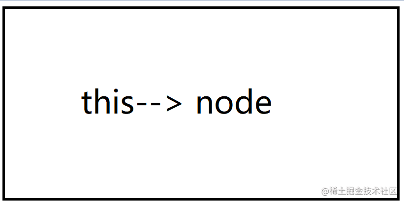

## 和浏览器里面不同的地方：

创建 `main.js`

```js
   function test() {
      this.names = "anikin";
    }
    this.names = 'zhangsan';
    test();
    
    console.log(this, this.name)  // {}  zhangsan
    console.log(global.names) // aninkin
    
     // 在打印一下看看这个this指向哪里呢
     console.log(this === module.exports); // true
```
通过上面的代码分析得出几个结论：
- 函数里面的`this`指向的是全局的 `global`。
- 整个运行文件里面的 `this`是指向 `module.exports`的。这个可以参考[模块化原理](https://juejin.cn/post/6966614457603047431)。

我们都知道 `exports = module.exports` ，是存在引用关系的，内存引用一般也是服从堆栈调用的规则。因此我们可以使用`this`来验证一下。

js 里面很基础的引用关系。

```js
var a = { name: "anikin" };
var b = a;
a = { age: 23 };

console.log(a, b); 
```
输出结果是： `{ age: 23 }  { name: "anikin" }`。

所以验证下上面的`exports`的关系。新建文件`test.js`:

```js

console.log(this === exports);  // true
console.log(this === module.exports); // true

//
exports.c = 3;
module.exports = {
  a: 1,
  b: 2,
};
this.m = 5;

console.log(this);  
console.log(this === exports);
console.log(this === module.exports);
console.log(module.exports);

```
以此输出结果是：

```js
 { c: 3, m: 5 }
true
false
{ a: 1, b: 2 }

```
解释：在读取文件的时候,内部会调用访问文件函数：__temp.call
- 在访问模块的时候`this`指向的是`module.exports`,而`module.exports`为一个空对象，`exports = module.exports`;所以为什么开头一开始问什么打印的全部都是空对象,`require`函数返回的是`module.exports`，此时返回的是一个空对象`{}`。

- `exports`值也是空对象`{}`，当给`exports`赋值时：`exports.c=3`;此时值为一个引用值，相当于改变了堆地址内的值，但是引用堆房间的地址不变，所以修改`exports`的值`module.exports`也会改变，还是空对象`{c:3}`,此时的`this`也是`{c:3}`

- `module.exports={a:1,b:2}`;现在是改变了值,就相当于在堆中创建了一个新地址引用，然后指向新的房间，
所以`this`指向的还是原来的引用，故`this`与`module.exports`不相等，但是`this`和`exports`还是相等的


## 和浏览器相同的点：

类似对象，类，已经箭头函数等的`this`可以参考浏览器端的实现。

例如箭头函数：`this`是在定义函数时绑定的，不是在执行过程中绑定的。简单的说，函数在定义时，this就继承了定义函数的对象。

```js
const Events = require("events");
class MyEvent extends Events {}
var e1 = new MyEvent();

e1.on("start", function () {
  console.log("start:event ", this, this === e1);
});

e1.on("start", () => {
  console.log("start:event ", this, this === e1);
});

e1.emit("start", "anikin");
```
执行结果是：

```js
 anikin MyEvent true
 {} false
```


