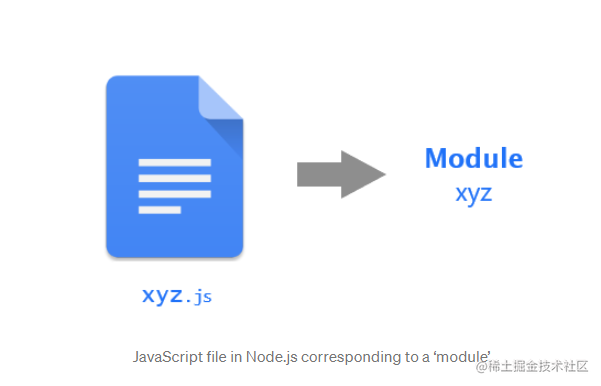

> Node.js treats each JavaScript file as a separate module.Node.js将每个JavaScript文件视为一个单独的模块。

例如，如果您有一个包含一些代码的文件，并且该文件名为xyz.js，则该文件将被视为Node中的一个模块，并且可以说您已经创建了一个名为的模块xyz。



假设你有一个`circle.js`的文件用于计算：

```js
    // constant
    const PI = 3.14; 

    /**
     * Function to calculate area of a circle with given radius r
     * @param {number} r
     * @returns {number} area of circle 
     */
    const calculateArea = r => PI * r * r;

    /**
     * Function to calculate circumference of a circle with given radius r
     * @param {number} r
     * @returns {number} circumference of circle 
     */
    const calculateCircumference = r => 2 * PI * r;
```
那么编写的代码在`nodejs`内部是如何运行的呢？这个就是node为每一个模块加载的，所有的模块都有这样一个`框架`。

```js
    (function(exports, require, module, __filename, __dirname) {
      // constant
      const PI = 3.14; 

      /**
       * Function to calculate area of a circle with given radius r
       * @param {number} r
       * @returns {number} area of circle 
       */
      const calculateArea = r => PI * r * r;

      /**
       * Function to calculate circumference of a circle with given radius r
       * @param {number} r
       * @returns {number} circumference of circle 
       */
      const calculateCircumference = r => 2 * PI * r;
    });
```

# commonjs 规范

`nodejs` 模块遵循的是 `commonjs`，那么什么是`commonjs`? 具有**模块标识(module)**、**模块定义(exports)** 、**模块引用(require)** 的js模块加载。
Node.js 采用了延迟加载的策略，只有在用到的情况下，系统模块才会被加载，加载完成后会放到 binding_cache 中。

# require 的机制

> 在 Node.js 中模块加载一般会经历 3 个步骤，**路径分析、文件定位、编译执行**。

按照模块的分类，按照以下顺序进行优先加载：

- **系统缓存**：模块被执行之后会会进行缓存，首先是先进行缓存加载，判断缓存中是否有值。
- **系统模块**：也就是原生模块，这个优先级仅次于缓存加载，部分核心模块已经被编译成二进制，省略了 路径分析、文件定位，直接加载到了内存中，系统模块定义在 Node.js 源码的 lib 目录下，可以去查看。

- **文件模块**：优先加载 .、..、/ 开头的，如果文件没有加上扩展名，会依次按照 .js、.json、.node 进行扩展名补足尝试，那么在尝试的过程中也是以同步阻塞模式来判断文件是否存在，从性能优化的角度来看待，.json、.node最好还是加上文件的扩展名。

- **目录做为模块**：这种情况发生在文件模块加载过程中，也没有找到，但是发现是一个目录的情况，这个时候会将这个目录当作一个 包 来处理，Node 这块采用了 Commonjs 规范，先会在项目根目录查找 package.json 文件，取出文件中定义的 main 属性 ("main": "lib/hello.js") 描述的入口文件进行加载，也没加载到，则会抛出默认错误: `Error: Cannot find module 'lib/hello.js'`。

- **node_modules** 目录加载：对于系统模块、路径文件模块都找不到，Node.js 会从当前模块的父目录进行查找，直到系统的根目录。

### 1： 加载完缓存的文件在哪里？

```js
   // add.js
    module.exports = {
       add: (a,b)=>a+b
    }
    
    const arg = require(add.js);
    console.log(requre.cache);
```
所以说分析完的路径缓存在内存里面的，怎么证明？在`require('add.js')`前后运行的内存大小比较。
```
// 之前
{"rss":"15.83 MB","heapTotal":"2.53 MB","heapUsed":"1.70 MB","external":"0.82 MB"}
// 之后
{"rss":"15.93 MB","heapTotal":"2.53 MB","heapUsed":"1.72 MB","external":"0.82 MB"}
```

### 2： 缓存带来的问题？
```js
    var add = require("./t.js").add;
    var add2 = require("./t.js").add;
    console.log(add())
    console.log(add())
    console.log(add2())
```

`t.js`如下写法：

```js
    var a = 10;
    module.exports.add  = function(){
        return ++a;
    }
```
执行结果是： 11，12, 13。证明：`nodejs`的`require` 缓存了函数中的 变量值，第二次`require`时 并未重新加载。

### 3： 删除缓存
```js
   delete require.cache[require.resolve('./myJson.js')];
```

# module.exports 和 exports之间的区别？

`exports` 相当于 `module.exports` 的快捷方式如下所示:


```js
const exports = modules.exports;
```
但是要注意不能改变 `exports` 的指向，我们可以通过 `exports.test = 'a'` 这样来导出一个对象, 但是不能向下面示例直接赋值，这样会改变 `exports` 的指向。 其实就是对象引用的问题。


```js
    // 错误的写法 将会得到 undefined
    exports = {
      'a': 1,
      'b': 2
    }

    // 正确的写法
    modules.exports = {
      'a': 1,
      'b': 2
    }
```


# 参考：
- http://nodejs.cn/api/modules.html#modules_modules


