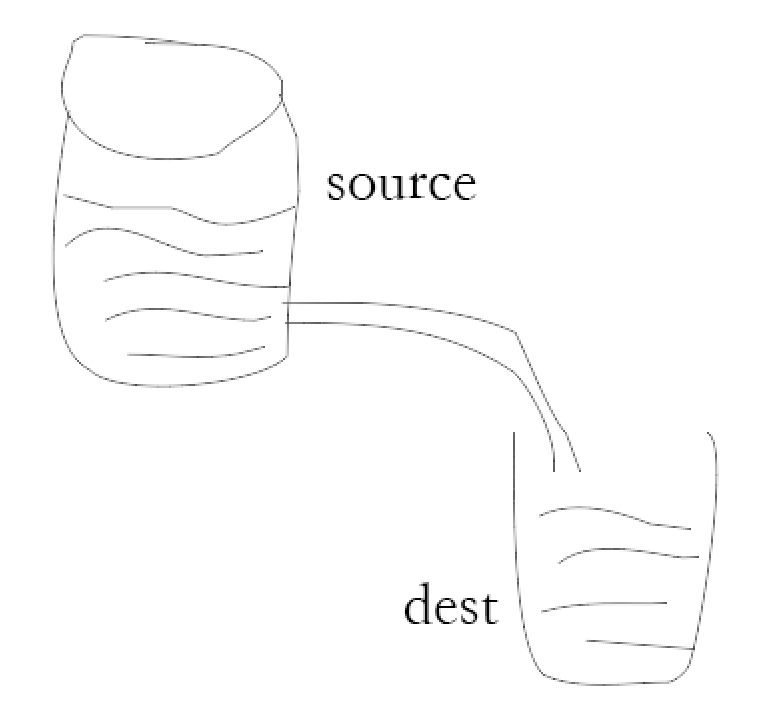

# nodejs 流
tips: `copy.mp4` 和 `sulian.mp4`内容过大，所以不提交，运行代码可以填补。

> 春水流啊流~~~~~~~~~~~~~~~水龙头，流出来的水是有序且有方向的。nodejs中有许多的对象或者方法都用到了流。比如说`HTTP`,`fs`和 `process.stdout`,`tcp socket` 就都是流的实例。流是一种抽象的接口，所有流的对象都是EventEmitter的实例，都实现了EventEmitter的接口。


# 作用
`nodeJS`中的流最大的作用是：读取大文件的过程中，不会一次性的读入到内存中。每次只会读取数据源的一个数据块。然后后续过程中可以立即处理该数据块(数据处理完成后会进入垃圾回收机制)。而不用等待所有的数据。

# 流的分类

- `Readable Stream` :可读数据流
- `Writeable Stream` ：可写数据流
- `Duplex Stream` ：双向数据流，可以同时读和写
- `Transform Stream`： 转换数据流，可读可写，同时可以转换（处理）数据


# fs.createReadStream() 可读流
> 可读流的 API 贯穿了多个 Node.js 版本，且提供了多种方法来消费流数据。 开发者通常应该选择其中一种方法来消费数据，不要在单个流使用多种方法来消费数据。 混合使用 `on('data')`、`on('readable')`、 pipe() 或异步迭代器，会导致不明确的行为

  1. 'readable'事件 当流中有数据可供读取时触发。
  2. 'data'事件 - 数据正在传递时，触发该事件（以chunk数据块为对象）
  3. 'end'事件 - 数据传递完成后，会触发该事件。
  4. 'close'事件
  5. 'error'事件
   
如果视频内容比较大，就会看到炫酷的刷频效果。
```
const fs = require('fs');
const fr = fs.createReadStream('./copy.mp4');
fr.on('readable',function(){
   // 有数据可读取。
  let data;
  while (data = this.read()) {
    console.log(data);
  }
});
```

`readable.resume();` 和 `readable.pause();` 控制上面视频流的输出频率，500ms.
```
fr.on('readable',function(){
   // 有数据可读取。
  let data;
  fr.pause();
  setTimeout(()=>{
    while (data = this.read()) {
        console.log(data);
      }
  },500);
});
```

# fs.createWriteStream() 可写流
- drain 如果调用 stream.write(chunk) 返回 false，则当可以继续写入数据到流时会触发 'drain' 事件
- finish
- error
- pipe 

