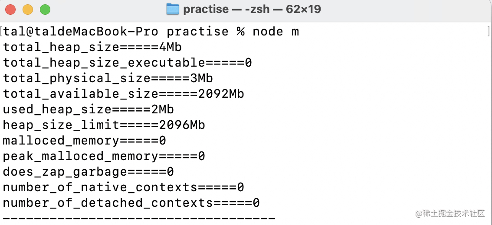
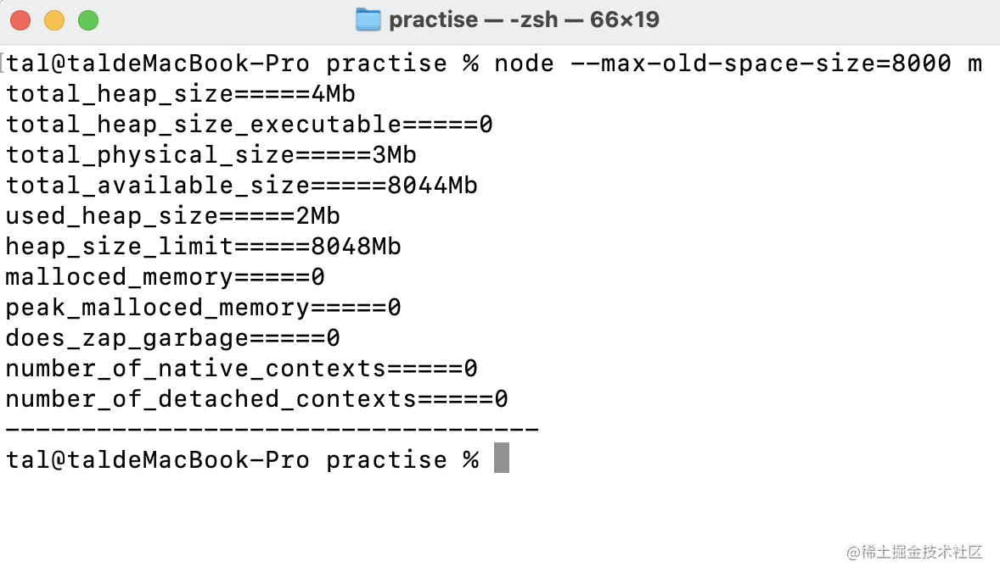
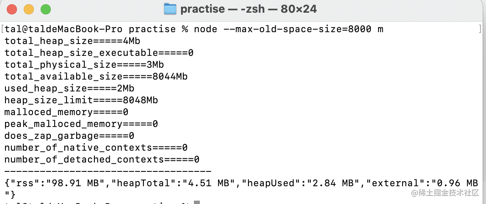
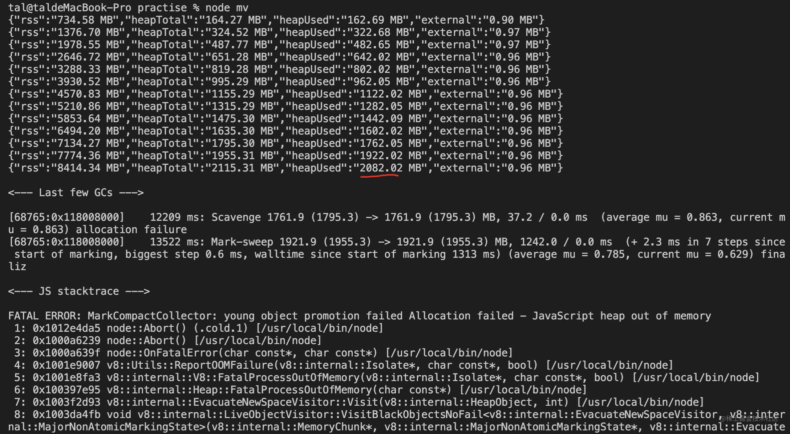
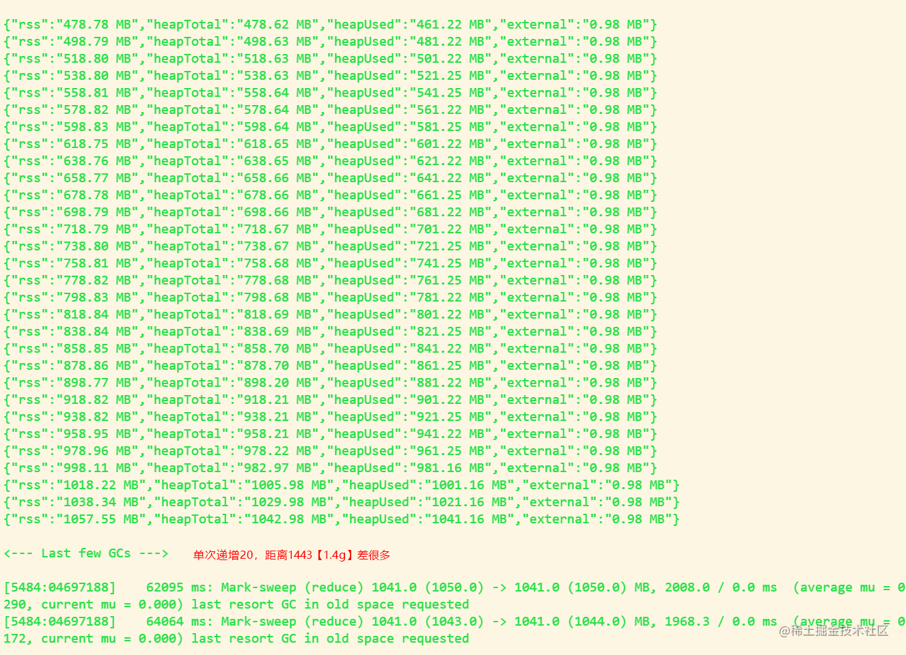
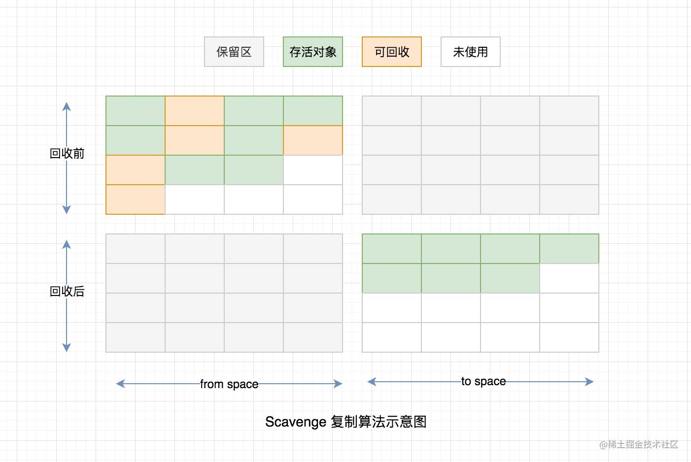
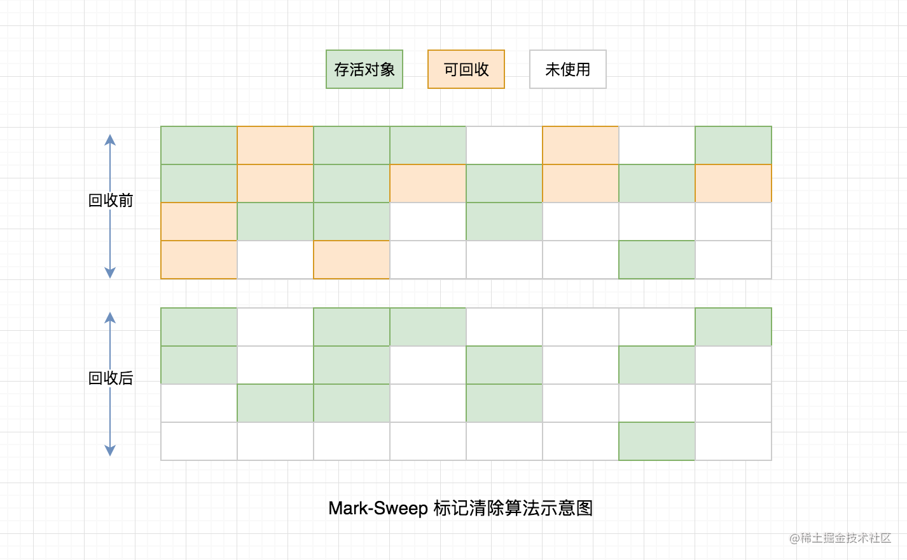
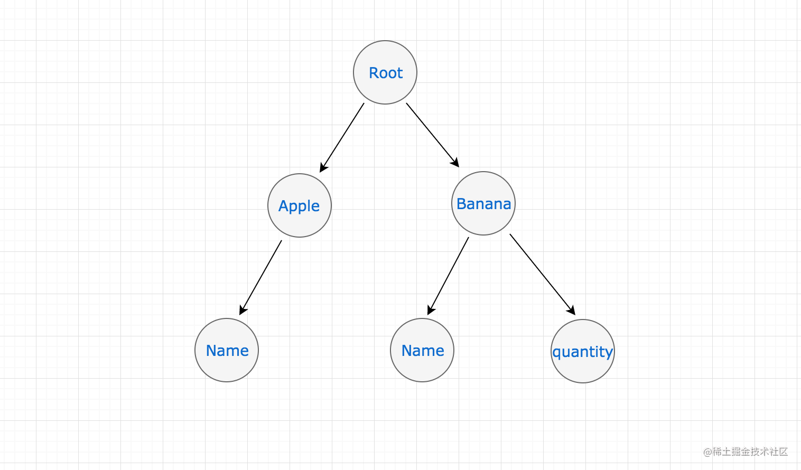
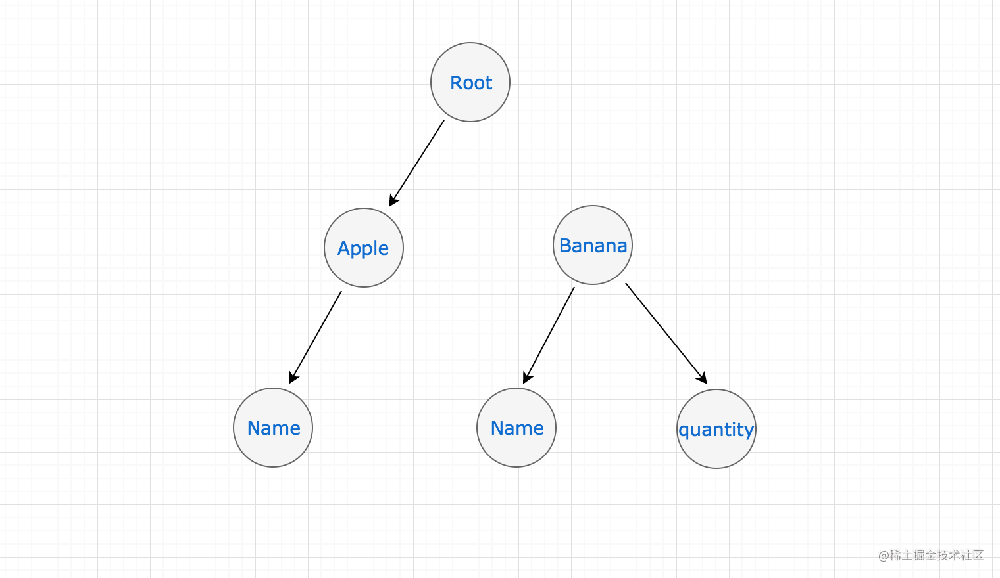
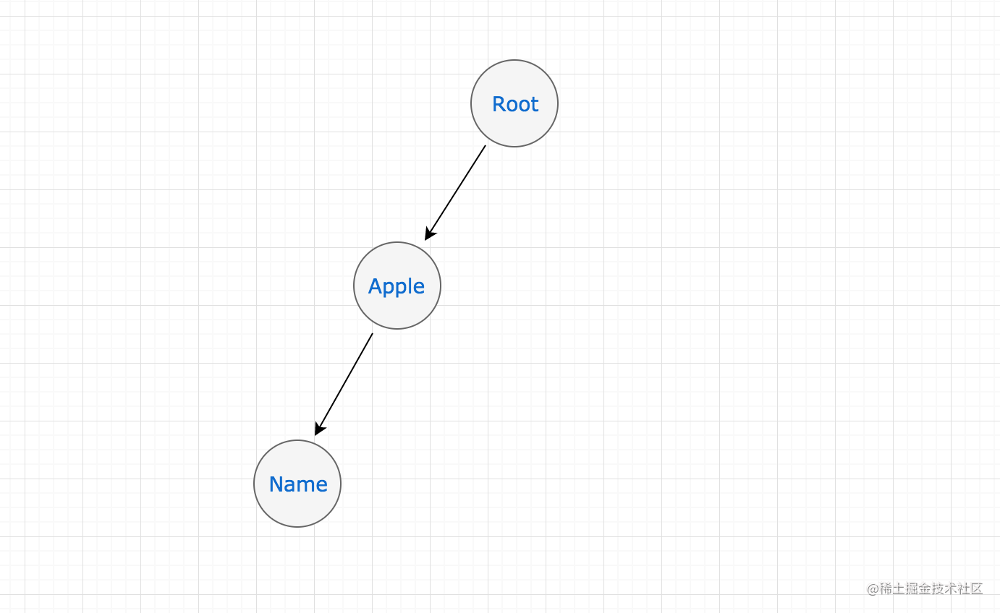

> 对于 Node.js 服务端研发的同学来说，关于垃圾回收、内存释放这块不需要向 C/C++ 的同学那样在创建一个对象之后还需要手动创建一个 delete/free 这样的一个操作进行 GC（垃圾回收）， Node.js 与 Java 一样，由虚拟机进行内存自动管理。

> 但是这样并不表示就此可以高枕无忧了，在开发中可能由于疏忽或者程序错误导致的内存泄漏也是一个很严重的问题，所以做为一名合格的服务端研发工程师，还是有必要的去了解下虚拟机是怎样使用内存的，遇到问题才能从容应对。

# V8内存限制

由于`nodejs`使用的是`Chrome V8`引擎,因此也被限制了所能使用的内存极限（64位为1.4GB，32位为1.0GB）。 因此当我们申请内存如果超过这个阈值的时候，程序就会就会因为堆内存不足溢出而退出。


**当我们在代码中声明变量并赋值时,所使用对象的内存就分配在堆中**.(堆栈是用来在Ram中存放数据的地方，与C++不同，Js自动管理栈和堆，程序员不能直接地设置栈或堆。)

如果已申请的堆空间内存不够分配新的对象,将继续申请堆空间,直到堆的大小超过V8的限制为止.当超过V8限制时，项目就会直接崩塌。

我们可以通过`v8`包来分析，默认`v8`分配和占用的内存：
```js
const v8 = require("v8");
const size = v8.getHeapStatistics();

function fmate(n) {
  let value = ~~(n / 1024 / 1024).toFixed(2);
  return value ? value + "Mb" : 0;
}

for (const iterator in size) {
  console.log(iterator + "=====" + fmate(size[iterator]));
}
```
具体看下这些参数的具体作用：

```js
gc-heap-stats包中的一些很好的解释:

`total_heap_size`: V8为堆分配的字节数.如果usedHeap需要更多,这可能会增长.
`used_heap_size`: 应用程序数据使用的字节数
`total_heap_size_executable`: 已编译的字节码和JITed代码的字节数
`heap_size_limit`: **堆不能超过的绝对限制(默认限制或--max_old_space_size)**
`total_physical_size:` 承诺大小
`does_zap_garbage`：是一个0/1布尔值,表示是否启用了--zap_code_space选项.这使得V8用位模式覆盖堆垃圾.RSS占用空间(驻留内存集)变得更大,因为它不断触及所有堆页面,这使得它们不太可能被操作系统换出.
`total_available_size`:可用堆大小
`malloced_memory`:通过malloc获得的当前内存量
`peak_malloced_memory`:通过malloc获得的峰值内存量
```

默认执行`node m.js`



我们查看`heap_size_limit=2.0G`左右。

再次执行`node -max-old-space-size=8000 m.js`


我们发现扩展后`heap_size_limit`和 `total_available_size`也随着发生了变化。

顺便打印下这个时候的`process.memoryUsage()`;




#### 测试场景1： `mac Apple M1 8G 内存`。

```js
// print 打印函数见下文
const total = [];
setInterval(function () {
  total.push(new Array(20 * 1024 * 1024)); // 大内存占用
  print();
}, 1000);

```
执行结果，显示`2g`,并不是说的`1.4`.也验证了上文验证的默认执行`v8`显示的可用堆大小。




#### 测试场景2： `win10 8g 内存 i7 x64`
    执行结果，接近`1g`,



#### 测试场景3: mac 下增加node运行内存

```js
tal@taldeMacBook-Pro practise % node --max_old_space_size=4096 mv
{"rss":"736.89 MB","heapTotal":"164.27 MB","heapUsed":"162.64 MB","external":"0.90 MB"}
{"rss":"1378.78 MB","heapTotal":"324.27 MB","heapUsed":"322.61 MB","external":"0.97 MB"}
{"rss":"2020.69 MB","heapTotal":"487.77 MB","heapUsed":"482.60 MB","external":"0.97 MB"}
{"rss":"2662.47 MB","heapTotal":"651.28 MB","heapUsed":"642.02 MB","external":"0.96 MB"}
{"rss":"3303.97 MB","heapTotal":"819.28 MB","heapUsed":"802.02 MB","external":"0.96 MB"}
{"rss":"3946.16 MB","heapTotal":"995.29 MB","heapUsed":"962.02 MB","external":"0.96 MB"}
{"rss":"4586.17 MB","heapTotal":"1155.29 MB","heapUsed":"1122.02 MB","external":"0.96 MB"}
{"rss":"5226.19 MB","heapTotal":"1315.29 MB","heapUsed":"1282.02 MB","external":"0.96 MB"}
{"rss":"5026.48 MB","heapTotal":"1475.30 MB","heapUsed":"1442.02 MB","external":"0.96 MB"}
{"rss":"4899.03 MB","heapTotal":"1635.30 MB","heapUsed":"1602.03 MB","external":"0.96 MB"}
{"rss":"4876.44 MB","heapTotal":"1795.30 MB","heapUsed":"1762.03 MB","external":"0.96 MB"}
{"rss":"5288.52 MB","heapTotal":"1955.31 MB","heapUsed":"1922.03 MB","external":"0.96 MB"}
{"rss":"5876.92 MB","heapTotal":"2115.31 MB","heapUsed":"2082.03 MB","external":"0.96 MB"}
{"rss":"9053.05 MB","heapTotal":"2275.32 MB","heapUsed":"2242.02 MB","external":"0.96 MB"}
{"rss":"9693.09 MB","heapTotal":"2435.32 MB","heapUsed":"2402.03 MB","external":"0.96 MB"}
{"rss":"10333.20 MB","heapTotal":"2595.32 MB","heapUsed":"2562.12 MB","external":"0.96 MB"}
{"rss":"10973.25 MB","heapTotal":"2755.33 MB","heapUsed":"2722.03 MB","external":"0.96 MB"}
{"rss":"11613.31 MB","heapTotal":"2915.33 MB","heapUsed":"2882.06 MB","external":"0.96 MB"}
{"rss":"12253.36 MB","heapTotal":"3075.34 MB","heapUsed":"3042.03 MB","external":"0.96 MB"}
{"rss":"12669.56 MB","heapTotal":"3235.34 MB","heapUsed":"3202.06 MB","external":"0.96 MB"}
{"rss":"12505.06 MB","heapTotal":"3395.34 MB","heapUsed":"3362.03 MB","external":"0.96 MB"}
{"rss":"13716.39 MB","heapTotal":"3555.35 MB","heapUsed":"3522.03 MB","external":"0.96 MB"}
{"rss":"13726.69 MB","heapTotal":"3715.35 MB","heapUsed":"3682.03 MB","external":"0.96 MB"}
{"rss":"13426.98 MB","heapTotal":"3875.36 MB","heapUsed":"3842.03 MB","external":"0.96 MB"}
{"rss":"13058.58 MB","heapTotal":"4035.36 MB","heapUsed":"4002.06 MB","external":"0.96 MB"}
{"rss":"15690.78 MB","heapTotal":"4164.11 MB","heapUsed":"4161.95 MB","external":"0.96 MB"}
```

# Nodejs中的GC
> Node.js 是一个基于 Chrome V8 引擎的 JavaScript 运行环境。

所以 V8 就是 Node.js 中使用的虚拟机，在之后讲解的 Node.js 中的 GC 其实就是在讲 V8 的 GC。

Node.js 与 V8 的关系也好比 Java 之于 JVM 的关系，另外 Node.js 之父 Ryan Dahl 在选择 V8 做为 Node.js 的虚拟机时 V8 的性能在当时已经领先了其它所有的 JavaScript 虚拟机，至今仍然是性能最好的，因此我们在做 Node.js 优化时，只要版本升级性能也会伴随着被提升。


### node 内存api以及案例

在 `Node.js` 环境里提供了 `process.memoryUsage` 方法用来查看当前进程内存使用情况，单位为字节.

- `rss（resident set size）`：`RAM` 中保存的进程占用的内存部分，包括代码本身、栈、堆。
- `heapTotal`：堆中总共申请到的内存量。
- `heapUsed`：堆中目前用到的内存量，判断内存泄漏我们主要以这个字段为准。
- `external`：`V8` 引擎内部的 `C++` 对象占用的内存。

分析文件 `text.js`如下：
```js
    /**
     * 单位为字节格式为 MB 输出
     */
    const format = function (bytes) {
        return (bytes / 1024 / 1024).toFixed(2) + ' MB';
    };

    /**
     * 封装 print 方法输出内存占用信息
     */
    const print = function() {
        const memoryUsage = process.memoryUsage();
        console.log(JSON.stringify({
            rss: format(memoryUsage.rss),
            heapTotal: format(memoryUsage.heapTotal),
            heapUsed: format(memoryUsage.heapUsed),
            external: format(memoryUsage.external),
        }));
    }
```

#### 1：空函数运行内存
执行 `node test.js`:   `{"rss":"93.06 MB","heapTotal":"4.26 MB","heapUsed":"2.63 MB","external":"0.90 MB"}`：

`test.js`本身也是需要内存，因此可以理解为上面就是初始化内存。

#### 2：创建一个堆外内存。
我们知道`buffer`是属于堆外内存，具体可以参考[ buffer 深入在深入](https://juejin.cn/post/6965337059842064391) 这篇文章。

在`test.js`的`print`函数第一行添加入下代码:
` var buf = Buffer.alloc(1024 * 1024 * 1024);`。 创建一个`1g`大小的堆外内存，这个时候再次执行：

```js
// 文件初始化：
{"rss":"93.06 MB","heapTotal":"4.26 MB","heapUsed":"2.63 MB","external":"0.90 MB"}

// 申请1g大小堆外内存：
{"rss":"93.52 MB","heapTotal":"3.76 MB","heapUsed":"1.87 MB","external":"1024.89 MB"}
```
**对比：**: 为什么`heapTotal`反而降低呢？暂时不表，下面给出答案。
`rss`：增加 0.46
`heapTotal`：减小0.5
`heapUsed`：减小0.76
`external`：增加 1g


#### 3. 读取一个`33.7M`图片`mv.jpg`文件：

```js
function readFile() {
  let text = fs.readFileSync("./mv.jpg", "utf-8");
  return text;
}

// 增加调用
function print(){
   let res = readFile();
   ....
}
```
**分析：**

```js
// 文件初始化：
{"rss":"93.06 MB","heapTotal":"4.26 MB","heapUsed":"2.63 MB","external":"0.90 MB"}

// 读取文件到内存里面
{"rss":"465.73 MB","heapTotal":"65.14 MB","heapUsed":"63.53 MB","external":"33.08 MB"}
```
**对比：**
`rss`：增加 `363.67MB`
`heapTotal`：增加 `60.88MB`
`heapUsed`：增加 `60.9MB`
`external`：增加 `32.18MB`


### node GC

> 垃圾回收是指回收那些在应用程序中不在引用的对象，当一个对象无法从根节点访问这个对象就会做为垃圾回收的候选对象。这里的根对象可以为全局对象、局部变量，无法从根节点访问指的也就是不会在被任何其它活动对象所引用。

在 V8 中也提供了两个参数仅在启动阶段调整内存限制大小，分别为调整**老生代**、**新生代**空间。

`–max-old-space-size=2048`
`–max-new-space-size=2048`

当然内存也并非越大越好，一方面服务器资源是昂贵的，另一方面`V8` 以 `1.5GB` 的堆内存进行一次小的垃圾回收大约需要 50 毫秒以上时间，这将会导致 `JavaScrip`t 线程暂停，这也是最主要的一方面。

#### 新生代与老生代

绝对大多数的应用程序对象的存活周期都会很短，而少数对象的存活周期将会很长为了利用这种情况，V8 将堆分为两类新生代和老生代，**新空间中的对象都非常小大约为 1-8MB**，这里的垃圾回收也很快。新生代空间中垃圾回收过程中幸存下来的对象会被提升到老生代空间。

##### **新生代空间**
由于新空间中的垃圾回收很频繁，因此它的处理方式必须非常的快，采用的 Scavenge 算法，是一种复制算法，新生代空间会被一分为二划分成两个相等大小的 from-space 和 to-space。它的工作方式是将 from space 中存活的对象复制出来，然后移动它们到 to space 中或者被提升到老生代空间中，对于 from space 中没有存活的对象将会被释放。完成这些复制后在将 from space 和 to space 进行互换.



Scavenge 算法非常快适合少量内存的垃圾回收，但是它有很大的空间开销，对于新生代少量内存是可以接受的

##### 老生代空间

新生代空间在垃圾回收满足一定条件（是否经历过 `Scavenge` 回收、`to space` 的内存占比）会被晋升到老生代空间中，在老生代空间中的对象都已经至少经历过一次或者多次的回收所以它们的存活概率会更大。在使用 Scavenge 算法则会有两大缺点一是将会重复的复制存活对象使得效率低下，二是对于空间资源的浪费，所以在老生代空间中采用了 `Mark-Sweep`（标记清除） 和 `Mark-Compact`（标记整理） 算法。


Mark-Sweep 处理时分为标记、清除两个步骤，与 Scavenge 算法只复制活对象相反的是在老生代空间中由于活对象占多数 Mark-Sweep 在标记阶段遍历堆中的所有对象仅标记活对象把未标记的死对象清除，这时一次标记清除就已经完成了。


看似一切 perfect 但是还遗留一个问题，被清除的对象遍布于各内存地址，产生很多内存碎片


##### Mark-Compact

在老生代空间中为了解决 Mark-Sweep 算法的内存碎片问题，引入了 Mark-Compact（标记整理算法），其在工作过程中将活着的对象往一端移动，这时内存空间是紧凑的，移动完成之后，直接清理边界之外的内存。


为何垃圾回收是昂贵的？V8 使用了不同的垃圾回收算法 `Scavenge`、`Mark-Sweep`、`Mark-Compact`。这三种垃圾回收算法都避免不了在进行垃圾回收时需要将应用程序暂停，待垃圾回收完成之后在恢复应用逻辑，对于新生代空间来说由于很快所以影响不大，但是对于老生代空间由于存活对象较多，停顿还是会造成影响的，因此，V8 又新增加了增量标记的方式减少停顿时间。


# 内存泄漏
> 内存泄漏（Memory Leak）是指程序中己动态分配的堆内存由于某种原因程序未释放或无法释放，造成系统内存的浪费，导致程序运行速度减慢甚至系统崩溃等严重后果。

#### 全局变量
未声明的变量或挂在全局 global 下的变量不会自动回收，将会常驻内存直到进程退出才会被释放，除非通过 delete 或 重新赋值为 undefined/null 解决之间的引用关系，才会被回收。

#### 闭包
#### 慎将内存做为缓存

通过内存来做缓存这可能是我们想到的最快的实现方式，另外业务中缓存还是很常用的，但是了解了 Node.js 中的内存模型和垃圾回收机制之后在使用的时候就要谨慎了，为什么呢？缓存中存储的键越多，长期存活的对象也就越多,垃圾回收时将会对这些对对象做无用功。

以下举一个获取用户 Token 的例子，memoryStore 对象会随着用户数的增加而持续增长，以下代码还有一个问题，当你启动多个进程或部署在多台机器会造成每个进程都会保存一份，显然是资源的浪费，最好是通过 Redis 做共享。

```js
const memoryStore = new Map();

exports.getUserToken = function (key) {
    const token = memoryStore.get(key);

    if (token && Date.now() - token.now > 2 * 60) {
        return token;
    }

    const dbToken = db.get(key);
    memoryStore.set(key, {
        now: Date.now(),
        val: dbToken,
    });
    return token;
}

```

#### 模块私有变量内存永驻
在加载一个模块代码之前，Node.js 会使用一个如下的函数封装器将其封装，保证了顶层的变量（var、const、let）在模块范围内，而不是全局对象。

这个时候就会形成一个闭包，在 require 时会被加载一次，将 exports 对象保存于内存中，直到进程退出才会回收，这个将会导致的是内存常驻，所以对一个模块的引用建议仅在头部引用一次缓存起来，而不是在使用时每次都加载，否则也会造成内存增加。


```js
(function(exports, require, module, __filename, __dirname) {
    // 模块的代码实际上在这里
});
```

#### 事件重复监听
在 Node.js 中对一个事件重复监听则会报如下错误，实际上使用的 `EventEmitte`r 类，该类包含一个 `listeners` 数组，默认为 10 个监听器超出这个数则会报警如下所示，用于发现内存泄漏，也可以通过 `emitter.setMaxListeners()` 方法为指定的 `EventEmitter` 实例修改限制。

#### 其它注意事项
在使用定时器 setInterval 时记的使用对应的 clearInterval 进行清除，因为 setInterval 执行完之后会返回一个值且不会自动释放。另外还有 map、filter 等对数组进行操作，每次操作之后都会创建一个新的数组，将会占用内存，如果单纯的遍历例如 map 可以使用 forEach 代替，这些都是开发中的一些细节，但是往往细节决定成败，每一次的内存泄漏也都是一次次的不经意间造成的。因此，这些点也是需要我们注意的。

# 手动进行垃圾回收
堆用来存放对象引用类型，例如字符串、对象。在以下代码中创建一个 Fruit 存放于堆中

```
// example.js
function Quantity(num) {
    if (num) {
        return new Array(num * 1024 * 1024);
    }
    return num;
}

function Fruit(name, quantity) {
    this.name = name
    this.quantity = new Quantity(quantity)
}

let apple = new Fruit('apple');
print();
let banana = new Fruit('banana', 20);
print();
```
执行以上代码，内存向下面所展示的，apple 对象 heapUsed 的使用仅有 4.21 MB，而 banana 我们对它的 quantity 属性创建了一个很大的数组空间导致 heapUsed 飙升到 164.24 MB

```js
$ node example.js

{"rss":"19.94 MB","heapTotal":"6.83 MB","heapUsed":"4.21 MB","external":"0.01 MB"}
{"rss":"180.04 MB","heapTotal":"166.84 MB","heapUsed":"164.24 MB","external":"0.01 MB"}
```

我们在来看下内存的使用情况，根节点对每个对象都持有引用，则无法释放任何内容导致无法 GC，正如下图所展示的



假设 banana 对象我们不在使用了，对它重新赋予一些新的值，例如 banana = null，看下此刻会发生什么？


```js
// example.js
let apple = new Fruit('apple');
print();
let banana = new Fruit('banana', 20);
print();
banana = null;
global.gc();
print();
```

以下代码中 --expose-gc 参数表示允许手动执行垃圾回收机制，将 banana 对象赋为 null 后进行 GC，在第三个 print 打印出的结果可以看到 heapUsed 的使用已经从 164.24 MB 降到了 3.97 MB

```js
$ node --expose-gc example.js
{"rss":"19.95 MB","heapTotal":"6.83 MB","heapUsed":"4.21 MB","external":"0.01 MB"}
{"rss":"180.05 MB","heapTotal":"166.84 MB","heapUsed":"164.24 MB","external":"0.01 MB"}
{"rss":"52.48 MB","heapTotal":"9.33 MB","heapUsed":"3.97 MB","external":"0.01 MB"}
```
下图所示，右侧的 banana 节点没有了任何内容，经过 GC 之后所占用的内存已经被释放了。




#### 内存检测工具

- `node-heapdump` : 是一个dumpV8堆信息的工具，
- `node-profiler` 是 `alinode` 团队出品的一个 与`node-heapdump` 类似的抓取内存堆快照的工具，
- `Easy-Monitor` 轻量级的 Node.js 项目内核性能监控 + 分析工具，https://github.com/hyj1991/easy-monitor 
- `Node.js-Troubleshooting-Guide` Node.js 应用线上/线下故障、压测问题和性能调优指南手册，Node.js-Troubleshooting-Guide
- `alinode`: Node.js 性能平台（Node.js Performance Platform）是面向中大型 Node.js 应用提供 性能监控、安全提醒、故障排查、性能优化等服务的整体性解决方案。alinode


# 参考文章
- https://blog.csdn.net/waiting677/article/details/103994983
- https://www.imooc.com/article/288799


