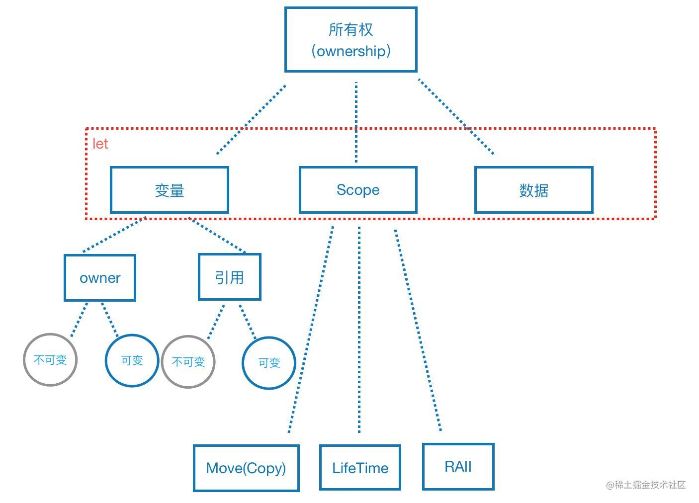
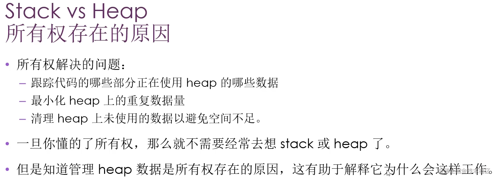
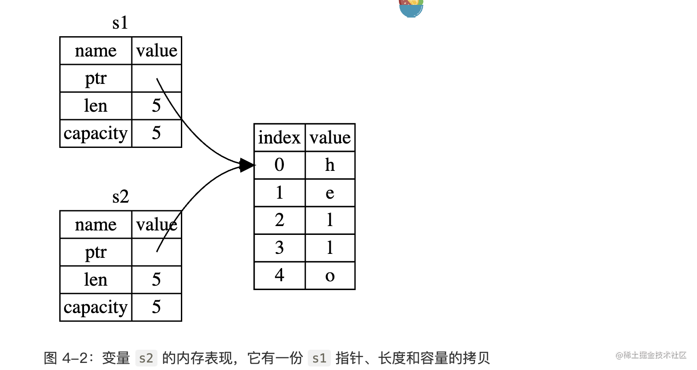
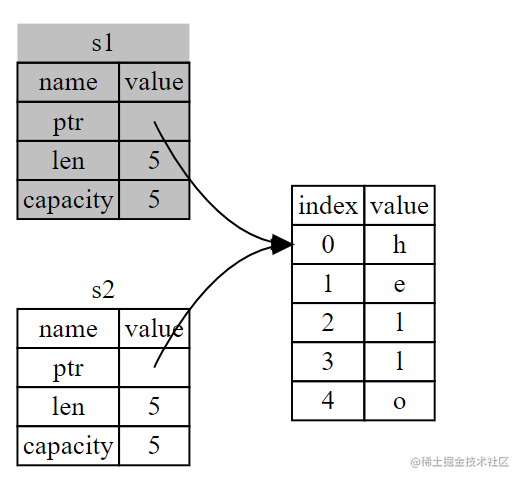
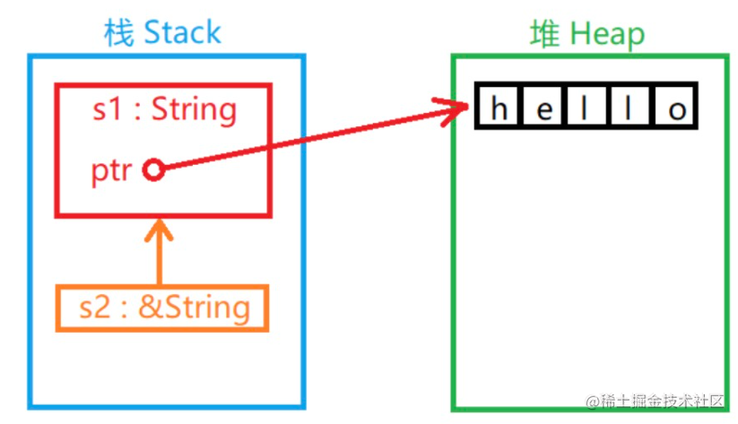

> 坚持才是靠近真理的唯一道路。

`Rust` 的核心功能（之一）是 **所有权（ownership)**，是其他语言所不具备的。

**所有运行的程序都必须管理其使用计算机内存的方式**。一些语言中具有垃圾回收机制，比如`js`和`java`的虚拟机，在程序运行时不断地寻找不再使用的内存；在另一些语言中，程序员必须亲自分配和释放内存比如`c++`。

`Rust` 则选择了第三种方式：**通过所有权系统管理内存，编译器在编译时会根据一系列的规则进行检查。在运行时，所有权系统的任何功能都不会减慢程序。**




上图中的语义树，主要是想表达下面几层意思：

1.  所有权是有好多个概念系统性组成的一个整体概念。
1.  let绑定，绑定了什么？变量 + 作用域 + 数据（内存）。
1.  move、lifetime、RAII都是和作用域相关的，所以想理解它们就先要理解作用域

### 堆 、栈

很多编程语言其实是不需要考虑`堆栈`的，但是`rust`系统级的编程语言需要考虑到。

#### a: 栈

**栈**（LIFO）后进先出的存贮解构。举例：叠盘子。

- 增加数据叫做 **进栈**（`pushing onto the stack`）。
- 而移出数据叫做 **出栈**（`popping off the stack`）。
- **栈中的所有数据都必须占用已知且固定的大小**。在编译时大小未知或大小可能变化的数据，要改为存储在堆上。


#### b: 堆

**堆** 向堆放入数据时，要先请求一定大小的空间。操作系统在堆的某处找到一块足够大的空位，把它标记为已使用，并返回一个表示该位置地址的 **指针**（`pointer`）。这个过程称作 **在堆上分配内存**（`allocating on the heap`），有时简称为 **“分配”（allocating）**。


#### c: 两者对比

栈内存从高位地址向下增长，且栈内存是连续分配的，一般来说**操作系统对栈内存的大小都有限制**，因此 C 语言中无法创建任意长度的数组。在 Rust 中，`main` 线程的[栈大小是 `8MB`](https://course.rs/pitfalls/stack-overflow.html)，普通线程是 `2MB`，在函数调用时会在其中创建一个临时栈空间，调用结束后 Rust 会让这个栈空间里的对象自动进入 `Drop` 流程，最后栈顶指针自动移动到上一个调用栈顶，无需程序员手动干预，因而栈内存申请和释放是非常高效的。

与栈相反，堆上内存则是从低位地址向上增长，**堆内存通常只受物理内存限制**，而且通常是不连续的，因此从性能的角度看，栈往往比堆更高。


- 将数据推入栈中并不被认为是分配。因为指针的大小是已知并且固定的，你可以将指针存储在栈上，不过当需要实际数据时，必须访问指针。

- 入栈比在堆上分配内存要快，因为（入栈时）操作系统无需为存储新数据去搜索内存空间；其位置总是在栈顶。

- 调用一个函数时，传递给函数的值（包括可能指向堆上数据的指针）和函数的局部变量被压入栈中。当函数结束时，这些值被移出栈。

**总结：跟踪哪部分代码正在使用堆上的哪些数据，最大限度的减少堆上的重复数据的数量，以及清理堆上不再使用的数据确保不会耗尽空间，这些问题正是所有权系统要处理的。**

#### d: [堆栈的性能](https://course.rs/advance/smart-pointer/box.html#%E5%A0%86%E6%A0%88%E7%9A%84%E6%80%A7%E8%83%BD)

很多人可能会觉得栈的性能肯定比堆高，其实未必。 由于我们在后面的性能专题会专门讲解堆栈的性能问题，因此这里就大概给出结论：

-   小型数据，在栈上的分配性能和读取性能都要比堆上高
-   中型数据，栈上分配性能高，但是读取性能和堆上并无区别，因为无法利用寄存器或 CPU 高速缓存，最终还是要经过一次内存寻址
-   大型数据，只建议在堆上分配和使用

总之，栈的分配速度肯定比堆上快，但是读取速度往往取决于你的数据能不能放入寄存器或 CPU 高速缓存。 因此不要仅仅因为堆上性能不如栈这个印象，就总是优先选择栈，导致代码更复杂的实现。




### 所有权规则：

- `Rust` 中的每一个值都有一个被称为其 所有者（owner）的变量。
- 值有且只有一个所有者。
- 当所有者（变量）离开作用域，这个值将被丢弃。


### String 类型

在 Rust 中有两种常用的字符串类型：`str` 和 `String`。`str` 是 `Rust` 核心语言类型，就是本章一直在讲的字符串切片`（String Slice）`，常常以引用的形式出现（`&str`）。

凡是用双引号包括的字符串常量整体的类型性质都是  **&str**：
```js
let s = "hello";
```

`String` 类型是 `Rust` 标准公共库提供的一种数据类型，它的功能更完善——它支持字符串的追加、清空等实用的操作。`String` 和 `str` 除了同样拥有一个字符开始位置属性和一个字符串长度属性以外还有一个容量`（capacity）`属性。

`String` 和 `str` 都支持切片，切片的结果是` &str` 类型的数据。

注意：**切片结果必须是引用类型。**:

```rust
let slice = &s[0..3];

// 有一个快速的办法可以将 String 转换成 &str：
let s1:String = String::from("hello");
let s2:&str = &s1[..];

// 反之，
let s3:String = "qiuyanlong".to_string();
```

`字符串自变量`和`String`的核心区别在于： **两个类型对内存的处理上**。

```rs
   // 字符串自变量的形式声明
    let s = "hello";
    println!("{}", s);

```

自变量形式声明字符串值被**硬编码**进程序里。字符串字面值是很方便的，不过他们并不适合使用文本的每一种场景。主要有两个缺点：
- **不可变的**。
- **并不是所有字符串的值都能在编写代码时就知道**，例如，要是想获取用户输入并存储。

为此，Rust 有第二个字符串类型，`String`。**这个类型被分配到堆上**，所以能够存储在编译时未知大小的文本`String` 被分配到堆上，所以能够存储在编译时未知大小的文本。

```rust
fn second_string() {
    //::是运算符，允许将特定的 `from` 函数置于 `String` 类型的命名空间namespace
    let mut s = String::from("hello");
    s.push_str(", world");
    println!("{}", s);
}
```
总结： 那么这里有什么区别呢？为什么 `String` 可变而字面值却不行呢？ **区别在于两个类型对内存的处理上**

就字符串字面值来说，我们在编译时就知道其内容，所以文本被直接硬编码进最终的可执行文件中。这使得字符串字面值快速且高效。不过这些特性都只得益于字符串字面值的不可变性。

不幸的是，我们不能为了每一个在编译时大小未知的文本而将一块内存放入二进制文件中，并且它的大小还可能随着程序运行而改变。

### 字符串对象常用的方法

| 方法                   | 原型                                                           | 说明                                                   |
| :------------------- | :----------------------------------------------------------- | :--------------------------------------------------- |
| `new()`              | pub const fn new() -> String                                 | 创建一个新的字符串对象                                          |
| `to_string()`        | fn to_string(&self) -> String                                | 将字符串字面量转换为字符串对象                                      |
| `replace()`          | pub fn replace<'a, P>(&'a self, from: P, to: &str) -> String | 搜索指定模式并替换                                            |
| `as_str()`           | pub fn as_str(&self) -> &str                                 | 将字符串对象转换为字符串字面量                                      |
| `push()`             | pub fn push(&mut self, ch: char)                             | 再字符串末尾追加字符                                           |
| `push_str()`         | pub fn push_str(&mut self, string: &str)                     | 再字符串末尾追加字符串                                          |
| `len()`              | pub fn len(&self) -> usize                                   | 返回字符串的字节长度                                           |
| `trim()`             | pub fn trim(&self) -> &str                                   | 去除字符串首尾的空白符                                          |
| `split_whitespace()` | pub fn split_whitespace(&self) -> SplitWhitespace            | 根据空白符分割字符串并返回分割后的迭代器                                 |
| `split()`            | pub fn split<'a, P>(&'a self, pat: P) -> Split<'a, P>        | 根据指定模式分割字符串并返回分割后的迭代器。模式 `P` 可以是字符串字面量或字符或一个返回分割符的闭包 |
| `chars()`            | pub fn chars(&self) -> Chars                                 | 返回字符串所有字符组成的迭代器                                      |

\


### 内存与分配

`String` 类型，为了支持一个可变，可增长的文本片段，需要在**堆**上分配一块在编译时未知大小的内存来存放内容。这意味着：

-   必须在运行时向操作系统请求内存。当调用 `String::from` 时，它的实现 (*implementation*) 请求其所需的内存。
-   需要一个当我们处理完 `String` 时将内存返回给操作系统的方法。在有 **垃圾回收**（*garbage collector*，*GC*）的语言中， GC 记录并清除不再使用的内存，而我们并不需要关心它。

**但是`Rust` 采取了一个不同的策略**：内存在拥有它的变量离开作用域后就被自动释放，`rust`就会调用`drop`方法。

```rust
fn main() {
 {
    let s = String::from("hello"); // 从此处起，s 是有效的
    // 使用 s
  }                                  // 此作用域已结束，
}                                   // s 不再有效
```

这个模式对编写 Rust 代码的方式有着深远的影响。现在它看起来很简单，不过在更复杂的场景下代码的行为可能是不可预测的，比如当有多个变量使用在堆上分配的内存时。现在让我们探索一些这样的场景。


#### 变量与数据交互的方式：1：移动 Move

**移动，是指所有权的转移。** 什么时候所有权会转移呢？**就是当变量切换作用域的时候，所谓移动，当然是从一个地方挪到另一个地方。** 其实你也可以这样认为，当变量切换到另一个作用域，它在当前作用域的绑定将会失效，它拥有的数据则会在另一个作用域被重新绑定。

但是对于实现了`Copy Trait`的类型来说，当移动发生的时候，它们可以`Copy`的副本代替自己去移动，而自身还保留着所有权。比如，Rust中的基本数字类型都默认实现了`Copy Trait`，比如下面示例：

```
let num = 42;
let num2 = num;
println!("{:?}", num);
```

此时，我们打印num，编译器不会报错。num已经move了，但是因为数字类型是默认实现Copy Trait，所以它move的是自身的副本，其所有权还在，并未发生转移，通过编译。不过需要注意的是，Rust 不允许自身或其任何部分实现了Drop trait 的类型使用Copy trait。

当move发生的时候，所有权被转移的变量，将会被释放。


```rust
let s1 = String::from("hello");
let s2 = s1;
println!("{}, world!", s1); // 报错 value borrowed here after move

```



当变量离开作用域后，Rust 自动调用 `drop` 函数并清理变量的堆内存。不过上图展示了两个数据指针指向了同一位置。这就有了一个问题：当 `s2` 和 `s1` 离开作用域，他们都会尝试释放相同的内存。这是一个叫做 **二次释放**（*double free*）的错误，也是之前提到过的内存安全性 bug 之一。两次释放（相同）内存会导致内存污染，它可能会导致潜在的安全漏洞

为了确保内存安全，这种场景下 Rust 的处理有另一个细节值得注意。与其尝试拷贝被分配的内存，Rust 则认为 `s1` 不再有效，因此 Rust 不需要在 `s1` 离开作用域后清理任何东西。



**浅拷贝（shallow copy）** 和 **深拷贝（deep copy）**，那么拷贝指针、长度和容量而不拷贝数据可能听起来像浅拷贝。不过因为 `Rust` 同时使第一个变量无效了，这个操作被称为 **移动（move）**，而不是浅拷贝。

隐含的一个设计原则：**Rust 不会自动自动创建数据的深拷贝，就运行时的性能而言，任何自动赋值的操作都是廉价的。**


#### 变量与数据交互的方式：2：克隆
如果我们 **确实** 需要深度复制 `String` 中堆上的数据，而不仅仅是栈上的数据，可以使用一个叫做 `clone` 的通用函数。

```rs
let s1 = String::from("hello");
let s2 = s1.clone();
println!("s1 = {}, s2 = {}", s1, s2);
```

#### 只在栈上的数据：3：拷贝
```rust
fn main() {
    let x = 5;
    let y = x;
    println!("x = {}, y = {}", x, y);
}

```
**像整型这样的在编译时已知大小的类型被整个存储在栈上**，所以拷贝其实际的值是快速的。这意味着没有理由在创建变量 y 后使 x 无效。

**`Copy trait`** 的特殊注解，可以用在类似整型这样的存储在栈上的类型上,类型拥有 `Copy trait`，一个旧的变量在将其赋值给其他变量后仍然可用。以下这些都是实现了这个注解的部分。**trait 可以理解为接口。**

- 任何简单标量值的组合可以是 `Copy` 的，不需要分配内存或某种形式资源的类型是 `Copy` 的
- 所有整数类型，比如 `u32`。
- 布尔类型，`bool`，它的值是 `true` 和 `false`。
- 所有浮点数类型，比如 `f64`。
- 字符类型，`char`。
- 元组，当且仅当其包含的类型也都是`Copy`的时候。比如，`(i32, i32)` 是 Copy 的，但 `(i32, String)` 就不是。


### 所有权与函数
在语义上，将值传递给函数和把值赋给变量是类似的： 只会发生两种情况： 移动或者复制。
```rust
fn main() {
    let s = String::from("hello");  // s 进入作用域
    takes_ownership(s);             // s 的值移动到函数里 ...
                                    // ... 所以到这里不再有效
    let x = 5;                      // x 进入作用域
    makes_copy(x);                  // x 应该移动函数里，
                                    // 但 i32 是 Copy 的，所以在后面可继续使用 x

} // 这里, x 先移出了作用域，然后是 s。但因为 s 的值已被移走，
  // 所以不会有特殊操作

fn takes_ownership(some_string: String) { // some_string 进入作用域
    println!("{}", some_string);
} // 这里，some_string 移出作用域并调用 `drop` 方法。占用的内存被释放

fn makes_copy(some_integer: i32) { // some_integer 进入作用域
    println!("{}", some_integer);
} // 这里，some_integer 移出作用域。不会有特殊操作
```

**有返回值的函数可以转移所有权**, 但是`rust`里面这部分实现是使用引用来实现的。
```rust
fn main() {
    // let (x, y): (usize, isize) = (1, 2);
    let s1 = String::from("hello");
    let (s2, len) = calculate_length(s1);
    println!("The length of '{}' is {}.", s2, len);
}

fn calculate_length(s: String) -> (String, usize) {
    let length = s.len();
    // 返回一个元组，
    (s, length);
}
```
变量的所有权总是遵循相同的模式：**将值赋给另一个变量时移动它。当持有堆中数据值的变量离开作用域时，其值将通过 drop 被清理掉，除非数据被移动为另一个变量所有。**


### 引用和借用
有的时候，我们并不想让变量的所有权转移，比如，我写一个函数，该函数只是给某个数组插入一个固定的值：
```
fn push(vec: &mut Vec<u32>) {
    vec.push(1);
}

fn main(){
    let mut vec = vec![0, 1, 3, 5];
    push(&mut vec);
    println!("{:?}", vec);
}
```

此时，我们把数组`vec`传给`push`函数，就不希望把所有权转移，所以，只需要传入一个可变引用`&mut vec`，因为我们需要修改`vec`，这样`push`函数就得了vec变量的可变借用，让我们去修改。push函数修改完，会将借用的所有权归还给vec，然后`println!`函数就可以顺利使用vec来输出打印。


引用非常方便我们使用，但是如果滥用的话，会引起安全问题，比如悬垂指针。看下面示例：

```
let r;
{
    let a = 1;
    r = &a;
}
println!("{}", r);
```

上面代码中，当a离开作用域的时候会被释放，但此时r还持有一个a的借用，编译器中的借用检查器就会告诉你：`a` does not live long enough。翻译过来就是：`a`活的不够久。这代表着a的生命周期太短，而无法借用给r，否则&a就指向了一个曾经存在但现在已不再存在的对象，这就是**悬垂指针**，也有人将其称为**野指针**。


**引用（Reference）** 是 C++ 开发者较为熟悉的概念。如果你熟悉指针的概念，你可以把它看作一种指针。**实质上"引用"是变量的间接访问方式。**

```rust
fn main() {
    let s1 = String::from("hello");
    let s2 = &s1;
    println!("s1 is {}, s2 is {}", s1, s2); // hello hello 
}
```

`&`运算符可以取变量的 **"引用"**。当一个变量的值被引用时，变量本身不会被认定无效。**因为"引用"并没有在栈中复制变量的值**。




```rust
fn main() {
    let s1 = String::from("hello");
    
    // &s1 语法让我们创建一个 指向 值 s1 的引用,但是并不拥有它。
    // 因为并不拥有这个值，当引用离开作用域时其指向的值也不会被丢弃。
    let len = calculate_length(&s1); 
    println!("The length of '{}' is {}.", s1, len);
}

// 函数签名使用 `&` 来表明参数 `s` 的类型是一个引用
fn calculate_length(s: &String) -> usize {
   // s 是对 String 的引用 s.len() 
} 
// 这里，s 离开了作用域。但因为它并不拥有引用值的所有权， // 所以什么也不会发生
```

这些 `& `符号就是引用，**它们允许你使用值但不获取其所有权**。

- 引用不会获得值的所有权。
- 引用只能租借（Borrow）值的所有权。
- 引用本身也是一个类型并具有一个值，这个值记录的是别的值所在的位置，但引用不具有所指值的所有权
- 禁止修改租借的值，除了`mut`修饰过的。也就是可变引用。

**可变引用：**
```rust
fn main() {
    let mut s = String::from("hello");
    change(&mut s);
    println!(">>{}", s);
}

fn change(some_string: &mut String) {
    some_string.push_str(", world");
}

```
限制：**在特定作用域中的特定数据有且只有一个可变引用**，这个限制的好处是 `Rust` 可以在编译时就避免数据竞争。**数据竞争（data race）**类似于竞态条件。

```rust
let mut s = String::from("hello");
let r1 = &mut s;
let r2 = &mut s; // 异常 second mutable borrow occurs here

println!("{}, {}", r1, r2);

```

但是可以通过创建新的作用域，来允许非同时创建的多个可变引用。
```rust
fn main(){
    let mut s = String::from();
    let s1 = &mut s;
    
    {
        let s2 = &mut s;
    }
}
```

不可以同时拥有一个可变引用和一个不变引用，多个不变引用是可以的

引用总结：、
 - 在任意给定时间，**要么** 只能有一个可变引用，**要么** 只能有多个不可变引用。
 - 引用必须总是有效的
 
 
一个引用的作用域从声明的地方开始一直持续到最后一次使用为止。例如，因为最后一次使用不可变引用在声明可变引用之前，所以如下代码是可以编译的：
 ```rs
let mut s = String::from("hello");
let r1 = &s; // 没问题
let r2 = &s; // 没问题
let r3 = &mut s; // 大问题 会报错，因为下面的打印再次使用到了r1 和 r2

println!("{}, {}, and {}", r1, r2, r3);
 ```
 
 **借用：**

我们将获取引用作为函数参数称为 **借用（borrowing**），正如现实生活中，如果一个人拥有某样东西，你可以从他那里借来。当你使用完毕，必须还回去。
 

### 悬垂引用（Dangling References）

在具有指针的语言中，很容易通过释放内存时保留指向它的指针而错误地生成一个 **悬垂指针（dangling pointer）**，**所谓悬垂指针是其指向的内存可能已经被分配给其它持有者**。

相比之下，在 `Rust` 中编译器确保引用永远也不会变成悬垂状态：**当你拥有一些数据的引用，编译器确保数据不会在其引用之前离开作用域**。

``` rust
fn main() {
    let reference_to_nothing = dangle();
}

fn dangle() -> &String { // dangle 返回一个字符串的引用
    let s = String::from("hello"); // s 是一个新字符串
    &s // 返回字符串 s 的引用
    
    // 解决的办法就是直接返回 return s;
} // 这里 s 离开作用域并被丢弃。其内存被释放。
  // 危险！
```

### slice 切片
**rust 的另外一种不持有所有权的数据类型** **切片Slice**。 案例引入：实现以下函数，接受字符串，返回第一个单词，如果没有找到任何空格，那么整个字符串就返回。   

```rust
fn main(){

    // 这里s0为什么可以执行，优点不太理解，按照道理&s0 是&String类型，但是就是可以执行
    // 暂时留个todo 
    // 是因为强制解引用的原因，rust自动强制转换了类型
    let s0 = String::from("aninkin is my name");
    let len = find_string(&s0);


    let s3 = String::from("fu is my name");
    let len3 = find_string(&s3[..]);


    let s2 = "jack is my friend";
    let j_str = find_string(s2);


    println!("len is {}-{}-{}", len,len3, j_str);
}

fn find_string(str: &str)->&str{
   let byte = str.as_bytes(); 
   for (i,&item) in byte.iter().enumerate() {
      if item == b' '{
          return &str[..i];
      }
   }
   &str[..]
}
```


另一个没有所有权的数据类型是 *slice*。slice 允许你引用集合中一段连续的元素序列，而不用引用整个集合。

**切片（Slice）** 是对数据值的部分引用。

在 Rust 中有两种常用的字符串类型：`str` 和 `String`。

`str` 是 `Rust` 核心语言类型，就是本章一直在讲的字符串切片`（String Slice）`，常常以引用的形式出现 **&str** ,凡是用双引号包括的字符串常量整体的类型性质都是 **&str**。
```rust
let s = "hello";
```

`Rust` 中的字符串类型实质上记录了字符在内存中的起始位置和其长度。

```rust
fn main() {
    let s = String::from("broadcast");
    let part1 = &s[0..5]; // 前闭后开的一个结构
    let part2 = &s[5..9];
    println!("{}={}+{}", s, part1, part2);
}
```

一些常见的省略写法：
```
..y 等价于 0..y
x.. 等价于位置 x 到数据结束
.. 等价于位置 0 到结束
```
被切片引用的字符串禁止更改其值, 因为只是部分引用, 切片结果必须是引用类型，但开发者必须自己明示这一点:
```rust
fn main() {
    let s = String::from("broadcast");
    let slice = &s[0..3];
    s.push_str('aa'); // 错误异常
    println!("slice>>> {}", slice);
}
```

**非字符串切片**:

除了字符串以外，其他一些线性数据结构也支持切片操作，例如数组：
```rust
fn main() {
    let arr = [1, 2, 3, 4, 5, 6];
    let part = &arr[..3];
    for i in part.iter() {
        println!(">>>{}", i);
    }
}
```

# 参考文章
- https://rust.bootcss.com/ch10-03-lifetime-syntax.html
- https://zhuanlan.zhihu.com/p/27571264?group_id=862978524611497984
- https://course.rs/advance/smart-pointer/box.html


