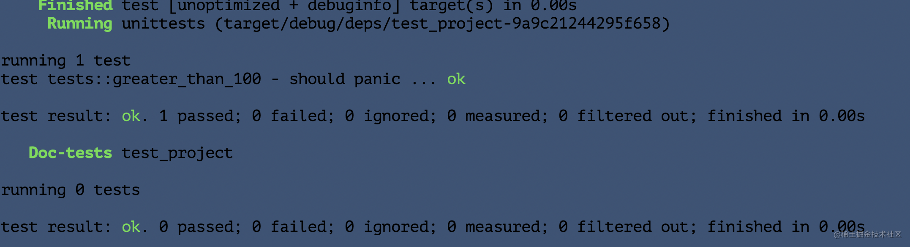
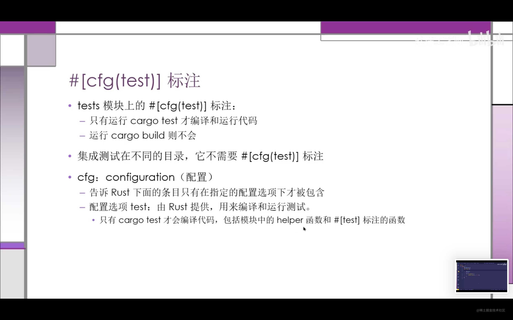
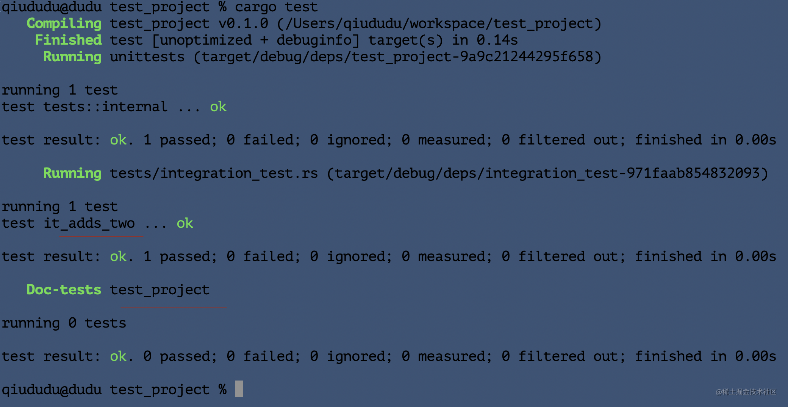

`Rust` 是一个相当注重正确性的编程语言，不过正确性是一个难以证明的复杂主题。Rust 的类型系统在此问题上下了很大的功夫，不过它不可能捕获所有种类的错误。为此，Rust 也在语言本身包含了编写软件测试的支持。

`Rust` 中的测试函数是用来验证非测试代码是否按照期望的方式运行的。测试函数体通常执行如下三种操作：

- 设置任何所需的数据或状态
- 运行需要测试的代码
- 断言其结果是我们所期望的


测试函数体（通常）执行3个操作：（3A）操作
- **准备数据/状态**
- **运行被测试的代码**
- **断言结果**

虽然无法直接测试 `main.rs` ,但是业务逻辑都在`lib.rs`里面，几乎所有的业务代码都可以测试，剩下的就算是入口函数里面的胶水代码。

### 解刨测试函数

测试函数需要使用`test`属性(`attribute`)进行标注。
- Attribute 就是一段rust代码的元数据。
- 在函数上加`#[test]`,可把函数变成测试函数。

```rust
// 创建一个新的库项目
cargo new rust_project --lib

```

### 运行测试
使用 `cargo test` 命令运行所有测试函数
- `Rust` 会构建一个`Test Runner`可执行文件。它会运行标注了`test`的函数，并报告其运行是否成功。
当使用了Cargo 创建library项目的时候，会生成一个`test module`,里面有一个`test`函数。


Cargo 编译并运行了测试。在 `Compiling`、`Finished` 和 `Running` 这几行之后，可以看到 `running 1 test` 这一行。下一行显示了生成的测试函数的名称，它是 `it_works`，以及测试的运行结果，`ok`。接着可以看到全体测试运行结果的摘要：`test result: ok.` 意味着所有测试都通过了。`1 passed; 0 failed` 表示通过或失败的测试数量


### 测试失败

```rust
#[cfg(test)]
mod tests {
    #[test]
    fn exploration() {
        assert_eq!(2 + 2, 4);
    }

    #[test]
    fn another() {
    
        // 表示测试失败，异常结束线程
        panic!("Make this test fail");
    }
}
```
**每一个测试都在一个新线程中运行，当主线程发现测试线程异常了，就将对应测试标记为失败。**


### 使用assert! 宏来检查

`assert!` 宏由标准库提供，在希望确保测试中一些条件为 `true` 时非常有用。 
`assert!` 宏提供一个求值为布尔值的参数。如果值是 `true`，`assert!` 什么也不做，同时测试会通过。如果值为 `false`，会调用`panic!`。

```rust
#[cfg(test)]
mod tests {
    #[test]
    fn larger_can_hold_smaller() {
        assert!(2>1);
    }
}

```

#### `assert_eq!` 和 `assert_ne!`来测试相等
- 都来自标准库
- 判断两个参数是否 **相等**或 **不等**。
- 实际上，它们使用的就是 `==`和`!=`运算。
- 断言失败，自动打印出两个参数的值。
```rust
pub fn add_two(a: i32) -> i32 {
    a + 2
}

fn rever_two(a:i32, b:i32) -> i32 {
    a - b
}

#[cfg(test)]
mod tests {
    use super::*;
    #[test]
    fn it_adds_two() {
        assert_eq!(4, add_two(2));
    }

    #[test]
    fn it_reverse_two(){
        // 单元测试也可以调用私有模块
        assert_eq!(4,rever_two(3,1));
    }
}
```

### 自定义失败消息
可以向`assert!`、`assert_eq!`、`assert_ne!`添加可选的自定义消息。
- 这些自定义消息和失败消息都会打印出来
- assert!: 第一个参数必填，自定义消息作为第二个参数
- assert_eq!和assert_ne!: 前两个参数必填，自定义消息作为第三个参数。
- 自定义消息参数会被传递给format!宏，可以使用{}占位符。

`lib.rs`:

```rust
pub fn greeting(name: &str) -> String {
    String::from("Hello!")
}

#[cfg(test)]
mod tests {
    use super::*;

    #[test]
    fn greeting_contains_name() {
        let result = greeting("Carol");
        assert!(
            result.contains("Carol"),
            "Greeting did not contain name, value was `{}`", result
        );
    }
}
```

### 使用should_panic 检查panic

除了检查代码是否返回期望的正确的值之外，检查代码是否按照期望处理错误也是很重要的。

可以通过对函数增加另一个属性 `should_panic` 来实现这些。
这个属性在函数中的代码 `panic` 时会通过，而在其中的代码没有 `panic` 时失败。

``` rust
fn main() {}
pub struct Guess {
    value: i32,
}

impl Guess {
    pub fn new(value: i32) -> Guess {
        if value < 1 {
            panic!("Guess value must be between 1 and 100, got {}.", value);
        }

        Guess {
            value
        }
    }
}

#[cfg(test)]
mod tests {
    use super::*;
    #[test]
    #[should_panic]
    fn greater_than_100() {
        Guess::new(0);
    }
}
```



让`should_panic` 更精确：添加一个可选得expected参数，将检查失败消息中是否包含指定的文字
```rust
fn main() {}
pub struct Guess {
    value: i32,
}

// --snip--

impl Guess {
    pub fn new(value: i32) -> Guess {
        if value < 1 {
            panic!("Guess value must be greater than or equal to 1, got {}.",
                   value);
        } else if value > 100 {
            panic!("Guess value must be less than or equal to 100, got {}.",
                   value);
        }

        Guess {
            value
        }
    }
}

#[cfg(test)]
mod tests {
    use super::*;

    #[test]
    #[should_panic(expected = "Guess value must be less than or equal to 100")]
    fn greater_than_100() {
        Guess::new(200);
    }
}

```

### 在测试中使用Result<T,E>
无需panic, 可使用Result<T,E>作为返回类型编写测试
- 返回ok: 测试通过
- 返回err,测试失败

注意：不要再Result<T,E>编写测试上标注#[should_panic]
```rust
#[cfg(test)]
mod tests {
    #[test]
    fn it_works() -> Result<(), String> {
        if 2 + 2 == 4 {
            Ok(())
        } else {
            Err(String::from("two plus two does not equal four"))
        }
    }
}

```

### 控制测试如何运行
改变`cargo test`的行为：添加命令行参数
默认行为：
- 并行运行
- 所有测试
- 捕获（不显示）所有输出，使读物与测试结果相关的数据更容易。

就像 `cargo run` 会编译代码并运行生成的二进制文件一样，`cargo test` 在测试模式下编译代码并运行生成的测试二进制文件。可以指定命令行参数来改变 `cargo test` 的默认行为。

`argo test` 生成的二进制文件的默认行为是并行的运行所有测试，并截获测试运行过程中产生的输出，阻止他们被显示出来，使得阅读测试结果相关的内容变得更容易。

命令行参数：
 - 针对`cargo test`的参数，紧跟在其后面
 - 针对测试可执行程序：放在 `--` 之后。
 - `cargo test --help`
 - `cargo test -- --help`


### 并行运行测试

运行多个测试，默认使用多个线程并行运行，运行快。

确保测试之间：**不会产生依赖，不依赖某个共享状态（环境，工作目录，环境变量等等）**。

如果你不希望测试并行运行，或者想要更加精确的控制线程的数量，可以传递 `--test-threads` 参数和希望使用线程的数量给测试二进制文件。例如：

```
$ cargo test -- --test-threads=1
```

这里将测试线程设置为 `1`，告诉程序不要使用任何并行机制。这也会比并行运行花费更多时间，不过在有共享的状态时，测试就不会潜在的相互干扰了

### 显示函数输出
Rust 的测试库会截获打印到标准输出的所有内容。比如在测试中调用了 `println!` 而测试通过了，我们将不会在终端看到 `println!` 的输出：只会看到说明测试通过的提示行。如果测试失败了，则会看到所有标准输出和其他错误信息。

如果你希望也能看到通过的测试中打印的值，截获输出的行为可以通过 `--nocapture` 参数来禁用：

```
$ cargo test -- --nocapture
```

### 通过指定名字来运行部分测试
```rust
#![allow(unused_variables)]
pub fn add_two(a: i32) -> i32 {
    a + 2
}

#[cfg(test)]
mod tests {
    use super::*;

    #[test]
    fn add_two_and_two() {
        assert_eq!(4, add_two(2));
    }

    #[test]
    fn add_three_and_two() {
        assert_eq!(5, add_two(3));
    }
}
```

可以在控制台单独运行：
```
cargo test add_three_and_two  // 单独测试这个一个测试单元
```


### 过滤运行多个测试

我们可以指定部分测试的名称，任何名称匹配这个名称的测试会被运行。

例如，上面这个case中因为头两个测试的名称包含 `add`，可以运行 `cargo test add` 。


### 忽略测试
有时一些特定的测试执行起来是非常耗费时间的，所以在大多数运行 `cargo test` 的时候希望能排除他们。虽然可以通过参数列举出所有希望运行的测试来做到，也可以使用 `ignore` 属性来标记耗时的测试并排除他们，如下所示：

``` rust

#[test]
fn it_works() {
    assert_eq!(2 + 2, 4);
}

#[test]
#[ignore]
fn expensive_test() {
    // 需要运行一个小时的代码
}
```

运行被忽略的：`cargo test -- --ignored`.

### 测试的组织结构

Rust 社区倾向于根据测试的两个主要分类来考虑问题：
 - **单元测试**（*unit tests*）：单元测试倾向于更小而更集中，在隔离的环境中一次测试一个模块，或者是测试私有接口。 **小，专注。**，可测试`private`接口。
 
 - **集成测试**（*integration tests*）：而集成测试对于你的库来说则完全是外部的。只能使用`public` 接口。


#### 单元测试

**单元测试**的目的**是在与其他部分隔离的环境中测试每一个单元的代码，以便于快速而准确的某个单元的代码功能是否符合预期**。单元测试与他们要测试的代码共同存放在位于 *src* 目录下相同的文件中。规范是在每个文件中创建包含测试函数的 `tests` 模块，并使用 `cfg(test)` 标注模块。





#### 集成测试

在rust里面，集成测试完全位于被测试库外部，目的是：**测试被测试库的多个部分是否能争取的一起工作。** 集成测试**覆盖率**很重要。

**tests目录**:
- 创建集成测试目录
- 里面的每个测试文件都是单独的一个`crate`。需要将被测试库导入，
- 无需标注 #[cfg(test)], tests目录被特殊对待。
- 只有`cargo test`才会编译`tests`目录下得文件。

`src` 同级别目录下创建`tests`文件夹，新建文件`integration_test.rs`。
```rust
use test_project;  // 主项目的名称

#[test]
fn it_adds_two() {
    assert_eq!(4, test_project::add_two(2));
}
```
`lib.rs`文件：
```rust
pub fn add_two(a: i32) -> i32 {
    internal_adder(a, 2)
}

fn internal_adder(a: i32, b: i32) -> i32 {
    a + b
}

#[cfg(test)]
mod tests {
    use super::*;

    #[test]
    fn internal() {
        assert_eq!(4, internal_adder(2, 2));
    }
}

```

执行`cargo test`：



